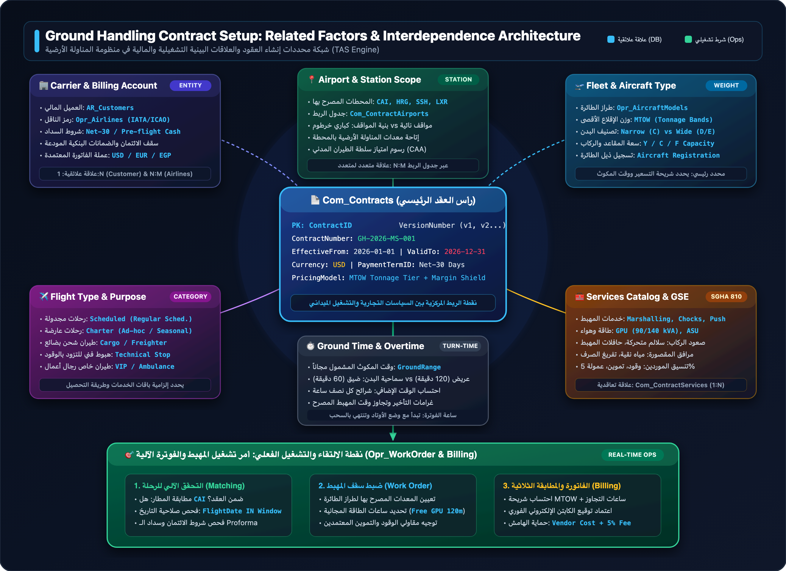

# دليل محددات إنشاء العقود وشبكة العلاقات البينية في منظومة المناولة الأرضية
## Ground Handling Contract Factors, Parameters & Relational Architecture Guide (TAS Engine)

---

## 📌 1. مقدمة عامة ورؤية معمارية (Executive Overview)

في صناعة المناولة الأرضية للطيران الدولي (**Aviation Ground Handling & Turnaround Services**)، لا يُعد العقد مجرد وثيقة قانونية أو نص أرشيفي؛ بل هو **محرك حسابي وتشغيلي متعدد الأبعاد (Multi-Dimensional Active Calculation Engine)**. 

عند تأسيس عقد جديد (**New Contract Master Setup**)، تتشابك مجموعة مترابطة من المحددات التشغيلية، والفيزيائية (كأوزان الطائرات)، والجغرافية (المحطات والمطارات)، والتجارية (شروط الائتمان وهوامش الربح). يُحدد هذا العقد بدقة:
1. **الغطاء التعاقدي:** من هي شركات الطيران المشمولة، وأي محطات مسموح لها بالهبوط فيها.
2. **حدود التشغيل في المهبط:** ما هي المعدات وساعات الطاقة (GPU) المسموحة مجاناً لكل طراز طائرة.
3. **محرك الفوترة الآلية:** كيفية احتساب التكلفة الفعلية استناداً إلى وزن الطائرة (MTOW)، والتوقيت (ليلي/نهاري)، والخدمات الإضافية، وحماية هوامش الربح مع مقاولي الباطن.

---

## 🗺️ 2. المخطط البصري العام: شبكة محددات العقد والعلاقات البينية

يوضح المخطط التالي الأبعاد الستة الرئيسية الحاكمة لإنشاء أي عقد أرضي، وكيف تلتقي جميعها في جدول العقد الرئيسي (`Com_Contracts`)، لتتحول في النهاية إلى **أمر تشغيل في المهبط (`Opr_WorkOrder`)** و**فاتورة معتمدة ومحمية من الهامش السالب**:

  
  
💡 يمكنك النقر على المخطط أعلاه لفتحه بصيغة الفيكتور فائقة الدقة (SVG).

---

## 🧩 3. الفهرس التفصيلي لمحددات العقد (Core Contract Factors)

عند النقر على زر **"إنشاء عقد جديد" (Create New Contract)** داخل نظام TAS، يتطلب النظام ضبط وتغذية 7 مجموعات محددات جوهرية:

  <!-- FACTOR 1: CARRIER & CUSTOMER -->
  

    

      

        🏢
        <h3 style="margin: 0; color: #a5b4fc; font-size: 18px;">1. محددات الناقل والعميل المالي (Carrier &amp; Billing Entity Factors)</h3>
      

      COMMERCIAL &amp; CREDIT
    

    

      
يُميز النظام بدقة بين <strong>الجهة التي تدفع الفاتورة (Customer / Debtor)</strong> وبين <strong>شركة الطيران المشغلة للرحلة (Operating Carrier)</strong>:

      <ul style="margin: 10px 24px;">
        <li><strong style="color: #f8fafc;">العميل المالي المحاسبي (<code>CustomerID / AR_Customers</code>):</strong> قد يكون شركة الطيران نفسها، أو وسيط رحلات عارضة (Charter Broker)، أو منظم رحلات سياحية (Tour Operator مثل TUI)، أو وكيل خدمات ملاحة وإشراف (Trip Support Agency مثل Jetex أو Hadid).</li>
        <li><strong style="color: #f8fafc;">رمز الناقل الجوي (<code>AirlineID / Opr_Airlines</code>):</strong> الرموز المعتمدة لمنظمة الطيران المدني الدولي والاتحاد الدولي للنقل الجوي (IATA/ICAO Codes مثل <code>MS / MSR</code> لمصر للطيران، <code>FZ / FDB</code> لفلاي دبي، <code>TK / THY</code> للتركية). يمكن للعقد الواحد تغطية عدة خطوط طيران شقيقة تتبع نفس المجموعة القابضة.</li>
        <li><strong style="color: #f8fafc;">شروط الائتمان والسداد (<code>PaymentTermsID</code>):</strong>
          Net-14 / Net-30 Days للرحلات المجدولة الموثوقة، أو 
          Pre-flight Cash / Proforma Wire Transfer بنسبة 100% للرحلات العارضة غير المنتظمة.</li>
        <li><strong style="color: #f8fafc;">عملة العقد والفوترة (<code>BillingCurrency</code>):</strong> العملة التعاقدية الملزمة (USD، EUR، أو EGP محلياً)، مع قاعدة ربط سعر الصرف الرسمي للبنك المركزي بتاريخ تنفيذ الرحلة.</li>
        <li><strong style="color: #f8fafc;">سقف الائتمان والضمان البنكي (Credit Limit &amp; Bank Guarantee):</strong> الحد المالي الأقصى المسموح به للمديونية قبل إيقاف إصدار أوامر التشغيل تلقائياً.</li>
      </ul>
    

  

  <!-- FACTOR 2: AIRPORT & STATIONS -->
  

    

      

        📍
        <h3 style="margin: 0; color: #6ee7b7; font-size: 18px;">2. محددات النطاق الجغرافي والمحطات (Airport &amp; Station Scope Factors)</h3>
      

      STATIONS &amp; APPRON
    

    

      
يحدد العقد المحطات الجوية المرخص بتقديم خدمات المناولة فيها:

      <ul style="margin: 10px 24px;">
        <li><strong style="color: #f8fafc;">المطارات المعتمدة (<code>AirportID / Opr_Airports</code>):</strong> كود المطار الدولي (مثل: <code>CAI</code> مطار القاهرة، <code>HRG</code> الغردقة، <code>SSH</code> شرم الشيخ، <code>LXR</code> الأقصر، <code>HBE</code> برج العرب).</li>
        <li><strong style="color: #f8fafc;">نوع الاتفاقية الجغرافية:</strong> إما اتفاقية محطة واحدة (Single-Station Handling Agreement) أو اتفاقية شبكة مطارات موحدة (Multi-Station National Network Agreement).</li>
        <li><strong style="color: #f8fafc;">طبيعة مواقف الطائرات بالمحطة (Stand Infrastructure):</strong>
          <ul>
            <li><strong>مواقف متصلة بالمبنى (Contact Stands / Jet Bridges):</strong> تقتضي احتساب رسوم استهلاك خرطوم الركاب، وتلغي الحاجة لحافلات المهبط.</li>
            <li><strong>مواقف نائية (Remote Apron Stands):</strong> تقتضي إلزامياً توفير سلالم متحركة (Mobile Passenger Stairs) وحافلات نقل ركاب المهبط (Cobus).</li>
          </ul>
        </li>
        <li><strong style="color: #f8fafc;">رسوم وامتيازات سلطة الطيران المدني (CAA Concession &amp; Royalties):</strong> الرسوم السيادية ونسب الإتاوة التي تختلف من مطار لآخر (مثال: رسوم مطار القاهرة الدولي تختلف عن رسوم مطارات الجذب السياحي الإقليمية).</li>
      </ul>
    

  

  <!-- FACTOR 3: FLEET & AIRCRAFT TYPE -->
  

    

      

        🛫
        <h3 style="margin: 0; color: #7dd3fc; font-size: 18px;">3. محددات الأسطول وطراز الطائرات (Aircraft Fleet &amp; Weight Factors)</h3>
      

      MTOW &amp; BODY CLASS
    

    

      
يُمثل وزن الطائرة وهيكلها الأساس الفيزيائي الأول لتسعير المناولة حول العالم وفق معايير IATA AHM:

      <ul style="margin: 10px 24px;">
        <li><strong style="color: #f8fafc;">طراز الطائرة (<code>ModelCode / Opr_AircraftModels</code>):</strong> كود الطراز العالمي (مثل: A320, A321, B737-800, B777-300ER, A330-300, B787-9).</li>
        <li><strong style="color: #f8fafc;">وزن الإقلاع الأقصى (MTOW - Maximum Take-Off Weight):</strong> المقياس القياسي لتحديد شريحة السعر الأساسي للمناولة (Handling Tonnage Bracket). تقسم الشرائح عادة إلى:
          [0-25t], [26-50t], [51-80t], [81-120t], [121-160t], [&gt;160t].</li>
        <li><strong style="color: #f8fafc;">تصنيف البدن (<code>BodyType</code>):</strong>
          <ul>
            <li><strong>بدن ضيق (Narrow-body / Code C):</strong> ممر واحد (مثل A320 / B737) - يحتاج وحدة طاقة أرضية (GPU 90 kVA)، وسلم ركاب واحد أو اثنين، ومعدل دوران قياسي 45 إلى 60 دقيقة.</li>
            <li><strong>بدن عريض (Wide-body / Code D/E/F):</strong> ممران (مثل B777 / A350) - يحتاج وحدة طاقة أرضية ثقيلة (GPU 140+ kVA)، رافعة منصات شحن سفلية (Main Deck Loader)، ومعدل دوران قياسي 90 إلى 120 دقيقة.</li>
          </ul>
        </li>
        <li><strong style="color: #f8fafc;">سعة المقاعد والركاب (Seat Capacity - Y/C/F):</strong> الحد الأقصى للمقاعد في الدرجة السياحية ورجال الأعمال والأولى (يستخدم عند احتساب رسوم الركاب Per-Passenger Head Charge).</li>
        <li><strong style="color: #f8fafc;">تسجيلات ذيل الطائرة (<code>Tail Number / Opr_AircraftRegistrations</code>):</strong> الحروف المعرفة للطائرة الفعلية المسجلة لدى الناقل (مثل: <code>SU-GCT</code> لمصر للطيران) لضمان الربط المباشر مع حركة الرادار وسجلات برج المراقبة.</li>
      </ul>
    

  

  <!-- FACTOR 4: FLIGHT OPERATION TYPE -->
  

    

      

        🔄
        <h3 style="margin: 0; color: #f0abfc; font-size: 18px;">4. محددات تصنيف الرحلة والغرض التشغيلي (Flight Mission &amp; Type Factors)</h3>
      

      FLIGHT CATEGORY
    

    

      
تختلف باقة الخدمات المطلوبة وشروط السداد وفقاً للغرض من تسيير الرحلة:

      <ul style="margin: 10px 24px;">
        <li><strong style="color: #f8fafc;">رحلات تجارية مجدولة (Scheduled Flights):</strong> رحلات يومية أو أسبوعية منتظمة بجدول معلن. يطبق عليها خصومات الحجم، وشروط الائتمان القياسية (Net-30)، وباقات المناولة الشاملة الكاملة.</li>
        <li><strong style="color: #f8fafc;">رحلات عارضة / سياحية (Charter Flights):</strong> رحلات موسمية أو عارضة غير منتظمة. تتطلب سداد الفاتورة المبدئية (Proforma) بنسبة 100% قبل صدور تصريح الهبوط وفتح أمر العمل.</li>
        <li><strong style="color: #f8fafc;">رحلات شحن بضائع (Cargo / Freighter Flights):</strong> طائرات شحن بدون ركاب. تستبعد خدمات الركاب والسلالم والمقصورة، وتلزم بإضافة رافعات المنصات (Main Deck Loaders) وعربات حاويات الشحن (ULD Dollies) واحتساب السعر بالطن المشحون.</li>
        <li><strong style="color: #f8fafc;">هبوط فني للتزود بالوقود (Technical Stop / Ferry Flight):</strong> هبوط سريع لا يشمل ركاباً أو تفريغ حقائب. يقتصر على الإرشاد، وتأمين الوقود، والأوتاد، بزمن مكوث قصير وسعر مخفض ومحدد سلفاً.</li>
        <li><strong style="color: #f8fafc;">طيران خاص ورجال أعمال (VIP / Business Aviation):</strong> متطلبات خدمة استثنائية تشمل صالات كبار الزوار، النقل بسيارات الليموزين بالمهبط، وحراسة خاصة.</li>
      </ul>
    

  

  <!-- FACTOR 5: SERVICES CATALOG & GSE -->
  

    

      

        🧰
        <h3 style="margin: 0; color: #fcd34d; font-size: 18px;">5. محددات فهرس الخدمات ومعدات المهبط (Services Catalog &amp; GSE Scope)</h3>
      

      IATA SGHA AHM 810
    

    

      
هيكلة بنود الاتفاقية وفق الفصول الدولية للاتحاد الدولي للنقل الجوي (IATA Standard Ground Handling Agreement):

      <ul style="margin: 10px 24px;">
        <li><strong style="color: #f8fafc;">خدمات ساحة الطيران (Ramp Operations - Section 3):</strong> وضع وسحب الأوتاد (Chocks On/Off)، الإرشاد (Marshalling)، القاطرة والدفع للخلف (Pushback Tractor)، تحميل وتفريغ الحقائب.</li>
        <li><strong style="color: #f8fafc;">معدات الدعم الأرضي ووحدات الطاقة (GSE Units):</strong>
          GPU (Ground Power Unit) بنظام النصف ساعة أو الساعة، 
          ASU (Air Start Unit) لبدء تشغيل المحركات، 
          ACU (Air Conditioning Unit) لتبريد المقصورة.</li>
        <li><strong style="color: #f8fafc;">مرافق مقصورة الطائرة (Cabin Services):</strong> تزويد مياه الشرب العذبة النقية (Potable Water)، تفريغ ومعالجة الصرف الصحي (Lavatory Waste)، والنظافة السريعة (Transit Cleaning).</li>
        <li><strong style="color: #f8fafc;">خدمات الركاب (Passenger Services - Section 2):</strong> مكاتب وزن الأمتعة وقبول الركاب (Check-in Desks)، بوابات الصعود، مكاتب الحقائب الضائعة (Lost &amp; Found / WorldTracer).</li>
        <li><strong style="color: #f8fafc;">خدمات مقاولي الباطن والوقود (Third-Party / Disbursed Services):</strong> تنسيق شاحنات الوقود وسيارات الإطفاء المرافقة، التموين (Catering)، وتخضع لنسبة عمولة إدارة (Disbursement Handling Fee 5% إلى 10%).</li>
      </ul>
    

  

  <!-- FACTOR 6: TIME TOLERANCES & OVERTIME -->
  

    

      

        ⏱️
        <h3 style="margin: 0; color: #e2e8f0; font-size: 18px;">6. محددات زمن المكوث والسماحية (Turnaround Ground Time &amp; Tolerances)</h3>
      

      TIME WINDOWS
    

    

      
الزمن هو المحدد المالي الحاسم؛ فبقاؤ الطائرة على أرض المهبط يُكلف موارد بشرية ومعدات حيوية:

      <ul style="margin: 10px 24px;">
        <li><strong style="color: #f8fafc;">وقت المكوث القياسي المشمول مجاناً (<code>GroundRange / TimeInclude</code>):</strong>
          زمن دوران الطائرة المشمول ضمن السعر الأساسي (مثال: أول ساعتين مجاناً للطائرات ضيقة البدن، و3 ساعات للطائرات عريضة البدن).</li>
        <li><strong style="color: #f8fafc;">شرائح احتساب الوقت الإضافي (Overtime Parking Gradients):</strong>
          في حال تأخر إقلاع الطائرة عن وقت السماح، يبدأ النظام في احتساب غرامات إشغال المهبط تلقائياً مجزأة لكل نصف ساعة إضافية.</li>
        <li><strong style="color: #f8fafc;">ساعات الطاقة المشمولة مجاناً (Included GPU Hours):</strong>
          تحديد عدد ساعات عمل وحدة الكهرباء المشمولة مع الباقة (مثلاً: أول ساعة مجاناً؛ وما زاد عنها يُفوتر تلقائياً بسعر الساعة المقررة في العقد).</li>
      </ul>
    

  

  <!-- FACTOR 7: PRICING LOGIC, SURCHARGES & VOLUME -->
  

    

      

        💰
        <h3 style="margin: 0; color: #fda4af; font-size: 18px;">7. محددات التسعير والبدلات وحوافز الحجم (Pricing Mechanics &amp; Margin Rules)</h3>
      

      MARGIN &amp; REBATE
    

    

      
القواعد المالية الصارمة التي تضمن ربحية المناول وتمنع التسرب:

      <ul style="margin: 10px 24px;">
        <li><strong style="color: #f8fafc;">ضمان الحد الأدنى للإيراد (<code>MinimumPrice Guarantee</code>):</strong> سقف أدنى مالي لا يمكن فوترة الرحلة بأقل منه تحت أي ظرف (حتى لو كانت الطائرة فارغة أو بحمولة منخفضة) لتغطية تكاليف الطاقم والمعدات.</li>
        <li><strong style="color: #f8fafc;">البدلات الإضافية للتشغيل الاستثنائي (<code>SureCharge</code>):</strong>
          نسب مئوية إضافية تضاف على السعر الأساسي للرحلة:
          بدل عمل ليلي (Night Surcharge +20% بين 22:00 و 06:00)، 
          بدل عطلات وأعياد رسمية (+25%)، 
          وبدل طلب خدمة طارئة في أقل من 24 ساعة (+30%).</li>
        <li><strong style="color: #f8fafc;">حائط صد الهامش السالب مع الموردين (Margin Shield):</strong>
          قاعدة برمجية ملزمة تمنع فوترة أي خدمة منفذة عبر مقاول خارجي (وقود/تموين) بسعر يقل عن فاتورة المقاول الفعلية، وتضيف آلياً عمولة المناول (مثلاً: <code>تكلفة الوقود + 5% Disbursement Fee</code>).</li>
        <li><strong style="color: #f8fafc;">شرائح خصم الحجم التراكمي (Volume Rebates):</strong>
          مكافأة الناقل عند تجاوزه عتبة عدد رحلات شهرياً (مثال: &gt; 25 رحلة شهرياً = خصم 5%؛ &gt; 50 رحلة شهرياً = خصم 10% يُمنح في نهاية الشهر كإشعار دائن Credit Note).</li>
      </ul>
    

  

---

## 🔗 4. مصفوفة العلاقات والتشابك البيني بين المحددات (Interdependence Matrix)

الجدول التالي يشرح **العلاقة الدقيقة (The Exact Relationship)** بين كل محددين، وكيف تؤثر التغييرات في محدد معين على باقي محددات النظام:

  

    📊 مصفوفة التأثير المتبادل والقواعد التشغيلية والمالية (Cross-Factor Interdependence Matrix)
    تكامل فيزيائي وتشغيلي ومالي
  

  

    <table style="width: 100%; border-collapse: collapse; text-align: right; font-size: 13px;">
      <thead>
        <tr style="border-bottom: 1px solid rgba(148, 163, 184, 0.2); background: rgba(30, 41, 59, 0.6); color: #38bdf8;">
          <th style="padding: 12px 16px; font-weight: 700;">المحدد الأول (Factor A)</th>
          <th style="padding: 12px 16px; font-weight: 700;">المحدد الثاني (Factor B)</th>
          <th style="padding: 12px 16px; font-weight: 700;">نوع العلاقة والترابط</th>
          <th style="padding: 12px 16px; font-weight: 700;">الأثر التشغيلي والمالي (Operational &amp; Financial Impact)</th>
          <th style="padding: 12px 16px; font-weight: 700;">القاعدة الحاكمة في النظام (TAS Business Rule)</th>
        </tr>
      </thead>
      <tbody>
        <!-- Row 1 -->
        <tr style="border-bottom: 1px solid rgba(148, 163, 184, 0.08); background: rgba(30, 41, 59, 0.25);">
          <td style="padding: 12px 16px; font-weight: 700; color: #f8fafc;">طراز الطائرة (MTOW)</td>
          <td style="padding: 12px 16px; color: #38bdf8; font-weight: 600;">السعر الأساسي للمناولة (Base Rate)</td>
          <td style="padding: 12px 16px;">تناسب طردي حسب الوزن</td>
          <td style="padding: 12px 16px; color: #cbd5e1;">كلما زاد وزن الطائرة (طن)، زادت شريحة المناولة ومقدار استهلاك معدات السحب والأوتاد.</td>
          <td style="padding: 12px 16px; color: #34d399; font-family: monospace; font-size: 12px;">BaseRate = MTOW_Band_Rate(Model.MTOW)</td>
        </tr>
        <!-- Row 2 -->
        <tr style="border-bottom: 1px solid rgba(148, 163, 184, 0.08); background: rgba(30, 41, 59, 0.15);">
          <td style="padding: 12px 16px; font-weight: 700; color: #f8fafc;">طراز الطائرة (Body Type)</td>
          <td style="padding: 12px 16px; color: #38bdf8; font-weight: 600;">سماحية زمن المكوث (Ground Tolerance)</td>
          <td style="padding: 12px 16px;">محدد فيزيائي للبنية</td>
          <td style="padding: 12px 16px; color: #cbd5e1;">البدن الضيق يمنح 60 دقيقة مجاناً، بينما العريض يمنح 90-120 دقيقة لكثافة الركاب وسعة العفش.</td>
          <td style="padding: 12px 16px; color: #34d399; font-family: monospace; font-size: 12px;">FreeTime = IF(BodyType='W', 120m, 60m)</td>
        </tr>
        <!-- Row 3 -->
        <tr style="border-bottom: 1px solid rgba(148, 163, 184, 0.08); background: rgba(30, 41, 59, 0.25);">
          <td style="padding: 12px 16px; font-weight: 700; color: #f8fafc;">طراز الطائرة (Body Type)</td>
          <td style="padding: 12px 16px; color: #38bdf8; font-weight: 600;">قدرة ونوع المعدات الأرضية (GSE Specification)</td>
          <td style="padding: 12px 16px;">اشتراط هندسي إلزامي</td>
          <td style="padding: 12px 16px; color: #cbd5e1;">البدن العريض يلزم بتعيين GPU 140 kVA بدلاً من 90 kVA، وقاطرة سحب ثقيلة (Heavy Pushback).</td>
          <td style="padding: 12px 16px; color: #34d399; font-family: monospace; font-size: 12px;">ValidateGSE(Model.BodyType, AssignedGSE)</td>
        </tr>
        <!-- Row 4 -->
        <tr style="border-bottom: 1px solid rgba(148, 163, 184, 0.08); background: rgba(30, 41, 59, 0.15);">
          <td style="padding: 12px 16px; font-weight: 700; color: #f8fafc;">المطار (Airport / Station)</td>
          <td style="padding: 12px 16px; color: #38bdf8; font-weight: 600;">طبيعة الخدمات الإلزامية (Mandatory Services)</td>
          <td style="padding: 12px 16px;">محدد بنية تحتية للموقف</td>
          <td style="padding: 12px 16px; color: #cbd5e1;">المواقف النائية بمطارات HRG/SSH تلزم بتشغيل حافلات وسلالم، بينما مواقف الكباري تلغيها.</td>
          <td style="padding: 12px 16px; color: #34d399; font-family: monospace; font-size: 12px;">Mutex(JetBridge, PassengerStairs + Bus)</td>
        </tr>
        <!-- Row 5 -->
        <tr style="border-bottom: 1px solid rgba(148, 163, 184, 0.08); background: rgba(30, 41, 59, 0.25);">
          <td style="padding: 12px 16px; font-weight: 700; color: #f8fafc;">تصنيف الرحلة (Flight Type)</td>
          <td style="padding: 12px 16px; color: #38bdf8; font-weight: 600;">شروط السداد (Payment Terms)</td>
          <td style="padding: 12px 16px;">حوكمة ومخاطر ائتمانية</td>
          <td style="padding: 12px 16px; color: #cbd5e1;">الرحلات العارضة (Charter) تلزم بسداد 100% مسبقاً، بينما المجدولة (Scheduled) تمنح Net-30.</td>
          <td style="padding: 12px 16px; color: #34d399; font-family: monospace; font-size: 12px;">IF(FlightType='Charter') Enforce_Proforma()</td>
        </tr>
        <!-- Row 6 -->
        <tr style="border-bottom: 1px solid rgba(148, 163, 184, 0.08); background: rgba(30, 41, 59, 0.15);">
          <td style="padding: 12px 16px; font-weight: 700; color: #f8fafc;">تصنيف الرحلة (Technical Stop)</td>
          <td style="padding: 12px 16px; color: #38bdf8; font-weight: 600;">باقة الخدمات (Service Scope)</td>
          <td style="padding: 12px 16px;">استبعاد خدمات الركاب</td>
          <td style="padding: 12px 16px; color: #cbd5e1;">الهبوط الفني يستبعد تلقائياً صعود الركاب، والتنظيف، والحقائب، ويقتصر على الوقود والأوتاد.</td>
          <td style="padding: 12px 16px; color: #34d399; font-family: monospace; font-size: 12px;">Suppress(PassengerCheckIn, BaggageLoading)</td>
        </tr>
        <!-- Row 7 -->
        <tr style="border-bottom: 1px solid rgba(148, 163, 184, 0.08); background: rgba(30, 41, 59, 0.25);">
          <td style="padding: 12px 16px; font-weight: 700; color: #f8fafc;">زمن المهبط الفعلي (Actual Ramp Time)</td>
          <td style="padding: 12px 16px; color: #38bdf8; font-weight: 600;">غرامات الوقت الإضافي (Overtime Billing)</td>
          <td style="padding: 12px 16px;">تجاوز حدود العقد</td>
          <td style="padding: 12px 16px; color: #cbd5e1;">إذا تجاوز مكوث الطائرة من لحظة الأوتاد وقت السماح، تُحسب تلقائياً شرائح انتظار إضافية.</td>
          <td style="padding: 12px 16px; color: #34d399; font-family: monospace; font-size: 12px;">OvertimeUnits = CEIL((RampTime - FreeTime)/30m)</td>
        </tr>
        <!-- Row 8 -->
        <tr style="border-bottom: 1px solid rgba(148, 163, 184, 0.08); background: rgba(30, 41, 59, 0.15);">
          <td style="padding: 12px 16px; font-weight: 700; color: #f8fafc;">فاتورة المورد (Supplier Cost)</td>
          <td style="padding: 12px 16px; color: #38bdf8; font-weight: 600;">سعر فوترة العميل (Customer Disbursed Price)</td>
          <td style="padding: 12px 16px;">حماية الهامش الربحي</td>
          <td style="padding: 12px 16px; color: #cbd5e1;">يُمنع فوترة خدمات الوقود والتموين بخسارة؛ يضاف هامش عمولة إدارة إلزامي فوق تكلفة المورد.</td>
          <td style="padding: 12px 16px; color: #34d399; font-family: monospace; font-size: 12px;">CustomerBill = SupplierCost * (1 + MarkupPct)</td>
        </tr>
        <!-- Row 9 -->
        <tr style="background: rgba(30, 41, 59, 0.25);">
          <td style="padding: 12px 16px; font-weight: 700; color: #f8fafc;">حجم الرحلات الشهري (Monthly Volume)</td>
          <td style="padding: 12px 16px; color: #38bdf8; font-weight: 600;">خصم الحجم التجاري (Volume Rebate)</td>
          <td style="padding: 12px 16px;">حافز ولاء تجاري</td>
          <td style="padding: 12px 16px; color: #cbd5e1;">وصول الناقل لأكثر من 30 رحلة شهرياً يُفعل خصم 5% على الفواتير التالية كإشعار دائن.</td>
          <td style="padding: 12px 16px; color: #34d399; font-family: monospace; font-size: 12px;">IF(FlightCount &gt;= Tier) Apply_Rebate()</td>
        </tr>
      </tbody>
    </table>
  

---

## 🧮 5. مكعب التسعير متعدد الأبعاد والمعادلة الحسابية (Multi-Dimensional Pricing Cube)

عند تشغيل رحلة فعلية على أرض المهبط، يقوم **محرك الفوترة (TAS Pricing Engine)** بجمع وتطبيق جميع هذه المحددات عبر دالة رياضية موحدة:

  // المعادلة الرياضية الشاملة لاحتساب فاتورة الرحلة في نظام TAS 
  <strong>TotalFlightInvoice</strong> =  
  &nbsp;&nbsp;&nbsp;&nbsp;<strong>MAX</strong>(  
  &nbsp;&nbsp;&nbsp;&nbsp;&nbsp;&nbsp;&nbsp;&nbsp;<strong>MinimumPriceGuarantee</strong>, 
  &nbsp;&nbsp;&nbsp;&nbsp;&nbsp;&nbsp;&nbsp;&nbsp;(  
  &nbsp;&nbsp;&nbsp;&nbsp;&nbsp;&nbsp;&nbsp;&nbsp;&nbsp;&nbsp;&nbsp;&nbsp;<strong>BaseHandlingFee</strong>(AirportID, Model.MTOW, FlightType)  
  &nbsp;&nbsp;&nbsp;&nbsp;&nbsp;&nbsp;&nbsp;&nbsp;&nbsp;&nbsp;&nbsp;&nbsp;+ <strong>OvertimeGroundFee</strong>(ActualGroundMinutes, GroundRangeLimit, OvertimeRatePerHalfHour)  
  &nbsp;&nbsp;&nbsp;&nbsp;&nbsp;&nbsp;&nbsp;&nbsp;&nbsp;&nbsp;&nbsp;&nbsp;+ <strong>ExtraGSECharges</strong>(ExtraGPUHours, ASUStarts, ACUHours)  
  &nbsp;&nbsp;&nbsp;&nbsp;&nbsp;&nbsp;&nbsp;&nbsp;&nbsp;&nbsp;&nbsp;&nbsp;+ <strong>AdHocCabinServices</strong>(WaterFlushes, ToiletFlushes, ExtraClean)  
  &nbsp;&nbsp;&nbsp;&nbsp;&nbsp;&nbsp;&nbsp;&nbsp;) * ( 1 + <strong>NightOrHolidaySurchargePct</strong> )  
  &nbsp;&nbsp;&nbsp;&nbsp;)  
  &nbsp;&nbsp;&nbsp;&nbsp;+ <strong>SubcontractorDisbursements</strong> [ ActualFuelCost + CateringCost ] * ( 1 + <strong>DisbursementFeePct 5%</strong> )  
  &nbsp;&nbsp;&nbsp;&nbsp;+ <strong>MandatoryAirportAuthorityTaxes</strong>(AirportID)  
  &nbsp;&nbsp;&nbsp;&nbsp;- <strong>VolumeTierDiscount</strong>(MonthlyAccumulatedFlights)

---

### 📝 3 سيناريوهات تشغيلية واقعية من المطارات المصرية

لتوضيح كيفية تفاعل هذه المحددات في الواقع العملي:

  <!-- Scenario 1: Scheduled A320 in CAI -->
  

    

      🟢 السيناريو 1: رحلة مجدولة منتظمة (مطار القاهرة CAI)
    

    <ul style="color: #cbd5e1; font-size: 12.5px; line-height: 1.6; margin: 0; padding-right: 18px;">
      <li><strong>الناقل والعميل:</strong> مصر للطيران (MS) - شروط سداد Net-30.</li>
      <li><strong>الطراز:</strong> Airbus A320 (Narrow-body / MTOW 77t).</li>
      <li><strong>الموقف:</strong> موقف كوبري (Contact Gate TB3).</li>
      <li><strong>التنفيذ:</strong> مكوث 55 دقيقة (ضمن سماح 60 دقيقة).</li>
      <li><strong>النتيجة المالية:</strong> تطبيق السعر الأساسي للبدن الضيق فقط ($1,250) + رسوم الكوبري، دون أي غرامات تأخير أو حافلات، وترحيل الفاتورة لدفتر الأستاذ العام مباشرة.</li>
    </ul>
  

  <!-- Scenario 2: Charter B737 in SSH with Overtime -->
  

    

      🟡 السيناريو 2: رحلة سياحية عارضة مع تأخير (شرم الشيخ SSH)
    

    <ul style="color: #cbd5e1; font-size: 12.5px; line-height: 1.6; margin: 0; padding-right: 18px;">
      <li><strong>الناقل والعميل:</strong> فلاي دبي (FZ) عبر وكيل سياحي - سداد 100% Proforma مسبقاً.</li>
      <li><strong>الطراز:</strong> Boeing 737-800 (MTOW 79t).</li>
      <li><strong>الموقف:</strong> موقف نائي (Remote Stand) يستلزم سلالم وحافلتين.</li>
      <li><strong>التنفيذ:</strong> مكوث 110 دقيقة (تجاوز حد السماح بـ 50 دقيقة) + ساعة GPU إضافية.</li>
      <li><strong>النتيجة المالية:</strong> احتساب شريحتين وقت إضافي (2 × $150 = $300) + ساعة GPU ($90) لتُخصم من الضمان المودع أو تصدر بها فاتورة فورية للكابتن.</li>
    </ul>
  

  <!-- Scenario 3: Widebody Cargo B777 in HRG -->
  

    

      🔴 السيناريو 3: طيران شحن عريض البدن ليلي (الغردقة HRG)
    

    <ul style="color: #cbd5e1; font-size: 12.5px; line-height: 1.6; margin: 0; padding-right: 18px;">
      <li><strong>الناقل:</strong> الخطوط التركية للشحن (TK Cargo) - B777F (MTOW 347t).</li>
      <li><strong>التصنيف:</strong> Cargo / Freighter - لا يوجد ركاب، إلغاء السلالم والحافلات.</li>
      <li><strong>المعدات:</strong> رافعة منصات شحن سفلية (Main Deck Loader) + قاطرة سحب ثقيلة.</li>
      <li><strong>التوقيت:</strong> الوصول 02:30 فجراً (تطبيق بدل التشغيل الليلي +20%).</li>
      <li><strong>النتيجة المالية:</strong> تطبيق أعلى شريحة MTOW للشحن ($3,800) + إضافة 20% بدل ليلي ($760) + تزويد 40 طن وقود مع عمولة إدارة 5% محمية.</li>
    </ul>
  

---

## 🗄️ 6. البنية العلائقية وقواعد البيانات (3NF Database Architecture)

لكي يعالج النظام هذه المحددات دون تعارض أو تكرار بيانات، يتم توزيعها على جداول مطبعة وفق معايير **المستوى الطبيعي الثالث (3NF)**:

📐 مصفوفة جداول قاعدة البيانات وحقول الربط المفتاحية (Relational DDL &amp; Schema Mapping)
3NF NORMALIZED

<table style="width: 100%; border-collapse: collapse; text-align: right; font-size: 12.5px;">
<thead>
<tr style="border-bottom: 1px solid rgba(148, 163, 184, 0.2); background: rgba(15, 23, 42, 0.85); color: #34d399;">
<th style="padding: 12px 14px; font-weight: 700;">اسم الجدول (Table Name)</th>
<th style="padding: 12px 14px; font-weight: 700;">نوع الكيان</th>
<th style="padding: 12px 14px; font-weight: 700;">المفتاح الأساسي (PK)</th>
<th style="padding: 12px 14px; font-weight: 700;">المفاتيح الأجنبية والربط (FK References)</th>
<th style="padding: 12px 14px; font-weight: 700; text-align: center;">العلاقة</th>
<th style="padding: 12px 14px; font-weight: 700;">قيد التكامل والأثر الرقابي</th>
</tr>
</thead>
<tbody>
<tr style="border-bottom: 1px solid rgba(148, 163, 184, 0.08); background: rgba(30, 41, 59, 0.25);">
<td style="padding: 12px 14px; font-weight: 700; color: #f8fafc;"><code>dbo.Com_Contracts</code></td>
<td style="padding: 12px 14px; color: #38bdf8;">رأس العقد (Master Hub)</td>
<td style="padding: 12px 14px; color: #fbbf24; font-family: monospace;">ContractID</td>
<td style="padding: 12px 14px; color: #cbd5e1;"><code>CustomerID ➔ AR_Customers</code></td>
<td style="padding: 12px 14px; text-align: center; color: #38bdf8; font-weight: 700;">1 : N</td>
<td style="padding: 12px 14px; color: #34d399;">حظر حذف العميل المرتبط بعقد نشط (RESTRICT)</td>
</tr>
<tr style="border-bottom: 1px solid rgba(148, 163, 184, 0.08); background: rgba(30, 41, 59, 0.15);">
<td style="padding: 12px 14px; font-weight: 700; color: #f8fafc;"><code>dbo.Com_ContractAirports</code></td>
<td style="padding: 12px 14px; color: #34d399;">جدول ربط المطارات</td>
<td style="padding: 12px 14px; color: #fbbf24; font-family: monospace;">(ContractID, AirportID)</td>
<td style="padding: 12px 14px; color: #cbd5e1;"><code>AirportID ➔ Opr_Airports</code></td>
<td style="padding: 12px 14px; text-align: center; color: #38bdf8; font-weight: 700;">N : M</td>
<td style="padding: 12px 14px; color: #cbd5e1;">حذف تابع تلقائي مع العقد (CASCADE)</td>
</tr>
<tr style="border-bottom: 1px solid rgba(148, 163, 184, 0.08); background: rgba(30, 41, 59, 0.25);">
<td style="padding: 12px 14px; font-weight: 700; color: #f8fafc;"><code>dbo.Com_ContractAirlines</code></td>
<td style="padding: 12px 14px; color: #a5b4fc;">جدول ربط شركات الطيران</td>
<td style="padding: 12px 14px; color: #fbbf24; font-family: monospace;">(ContractID, AirlineID)</td>
<td style="padding: 12px 14px; color: #cbd5e1;"><code>AirlineID ➔ Opr_Airlines</code></td>
<td style="padding: 12px 14px; text-align: center; color: #38bdf8; font-weight: 700;">N : M</td>
<td style="padding: 12px 14px; color: #cbd5e1;">حذف تابع تلقائي مع العقد (CASCADE)</td>
</tr>
<tr style="border-bottom: 1px solid rgba(148, 163, 184, 0.08); background: rgba(30, 41, 59, 0.15);">
<td style="padding: 12px 14px; font-weight: 700; color: #f8fafc;"><code>dbo.Com_ContractServices</code></td>
<td style="padding: 12px 14px; color: #fbbf24;">تعرفة الخدمات والبدلات</td>
<td style="padding: 12px 14px; color: #fbbf24; font-family: monospace;">ContractServiceID</td>
<td style="padding: 12px 14px; color: #cbd5e1;"><code>ServiceID ➔ Com_Services</code> <code>SupplierID ➔ AP_Suppliers</code></td>
<td style="padding: 12px 14px; text-align: center; color: #38bdf8; font-weight: 700;">1 : N</td>
<td style="padding: 12px 14px; color: #34d399;">تطبيق قاعدة حائط صد الهامش (Margin Shield)</td>
</tr>
<tr style="background: rgba(30, 41, 59, 0.25);">
<td style="padding: 12px 14px; font-weight: 700; color: #f8fafc;"><code>dbo.Opr_TurnaroundWorkOrders</code></td>
<td style="padding: 12px 14px; color: #fb7185;">نقطة الالتقاء والفوترة</td>
<td style="padding: 12px 14px; color: #fbbf24; font-family: monospace;">WorkOrderID</td>
<td style="padding: 12px 14px; color: #cbd5e1;"><code>ContractID, AirportID, AirlineID, RegistrationID</code></td>
<td style="padding: 12px 14px; text-align: center; color: #38bdf8; font-weight: 700;">1 : N</td>
<td style="padding: 12px 14px; color: #34d399;">منع الفوترة أو فتح أمر تشغيل خارج غطاء العقد</td>
</tr>
</tbody>
</table>

📄 رأس العقد: <code>dbo.Com_Contracts</code>

• <code>ContractID (PK, bigint)</code>: المعرف التعاقدي الفريد.

• <code>ContractNumber (nvarchar 50)</code>: رقم الاتفاقية المرجعي.

• <code>VersionNumber (int)</code>: إصدار العقد (v1, v2) للتعديلات الموسمية.

• <code>CustomerID (FK)</code>: يربط بجدول العميل المالي <code>AR_Customers</code>.

• <code>EffectiveFrom / ValidTo</code>: نافذة الصلاحية الزمنية وسريان العقد.

• <code>CurrencyCode / PaymentTermID</code>: عملة الفوترة وشروط الائتمان.

📍 ربط المطارات: <code>dbo.Com_ContractAirports</code> (N:M)

• <code>ContractID (PK/FK)</code>: مرجع العقد (Cascade Delete).

• <code>AirportID (PK/FK)</code>: مرجع المطار المصرح به (CAI, HRG...).

• <code>IsPrimaryStation (bit)</code>: المحطة الرئيسية لعمليات الناقل.

• <code>StationConcessionFee (decimal)</code>: رسوم امتياز سلطة المطار.

✈️ ربط شركات الطيران: <code>dbo.Com_ContractAirlines</code> (N:M)

• <code>ContractID (PK/FK)</code>: مرجع العقد.

• <code>AirlineID (PK/FK)</code>: مرجع خط الطيران (MS, FZ, TK...).

• <code>AllianceCode (nvarchar 20)</code>: تحالف الطيران المشترك.

🧰 تعرفة الخدمات: <code>dbo.Com_ContractServices</code>

• <code>ContractServiceID (PK, bigint)</code>: معرف البند الفريد.

• <code>ServiceID (FK)</code>: يربط بفهرس خدمات المناولة IATA SGHA.

• <code>NegotiatedPrice</code>: السعر التعاقدي المتفق عليه.

• <code>OvertimePrice</code>: سعر الساعة أو النصف ساعة الإضافية.

• <code>DefaultSupplierID (FK)</code>: المقاول المعتمد للخدمة.

🎯 نقطة الالتقاء التشغيلي والفوترة: <code>dbo.Opr_TurnaroundWorkOrders</code>

يرتبط هذا الجدول الميداني بجميع المفاتيح لضمان التحقق الفوري: <code>ContractID</code> + <code>AirportID</code> + <code>AirlineID</code> + <code>RegistrationID (طراز الطائرة والوزن)</code> + <code>FlightTypeCode</code>. يتحكم بالمهبط ويولد الفاتورة التلقائية والمطابقة الثلاثية (3-Way Matching).

---

## 📋 7. قائمة التحقق العملية عند إنشاء عقد جديد (Step-by-Step Contract Creation Checklist)

لضمان عدم إغفال أي محدد أو علاقة عند إدخال عقد جديد على شاشة TAS:

  

    

      1
      <strong>تحديد هوية العميل والناقلين:</strong> اختر العميل المالي المحاسبي، وحدد قائمة خطوط الطيران المشمولة في الاتفاقية.
    

    

      2
      <strong>تحديد نطاق المحطات:</strong> علم على المطارات المعتمدة للناقل (CAI, HRG, SSH) وحدد شروط كل محطة.
    

    

      3
      <strong>اعتماد مصفوفة أسطول الطائرات:</strong> ربط طرازات الطائرات المتوقعة للناقل والتأكد من أوزان MTOW وتصنيف البدن (Narrow vs Wide).
    

    

      4
      <strong>ضبط سقف السماحية والوقت المجاني:</strong> حدد مدة المكوث القياسية (مثلاً 60 دقيقة للبدن الضيق) وسعر نصف ساعة الانتظار الإضافي.
    

    

      5
      <strong>تحديد شروط الائتمان وسداد الـ Proforma:</strong> إذا كان الناقل يطير رحلات عارضة، فعل شرط "سداد الفاتورة المبدئية إلزامي قبل أمر العمل".
    

    

      6
      <strong>تفعيل حائط صد الهامش السالب (Margin Shield):</strong> حدد نسبة عمولة المناولة لموردي الوقود والتموين (بحد أدنى 5%).
    

    

      7
      <strong>اعتماد وحفظ العقد:</strong> بعد مراجعة الإدارة التجارية، يتم اعتماد العقد وتفعيله ليصبح جاهزاً لاستقبال طلبات الرحلات آلياً.
    

  

---

*تم إعداد وتوثيق هذا الدليل المعماري كمرجع شامل لهندسة العقود وعلاقاتها في منظومة TAS Ground Handling Engine.*
