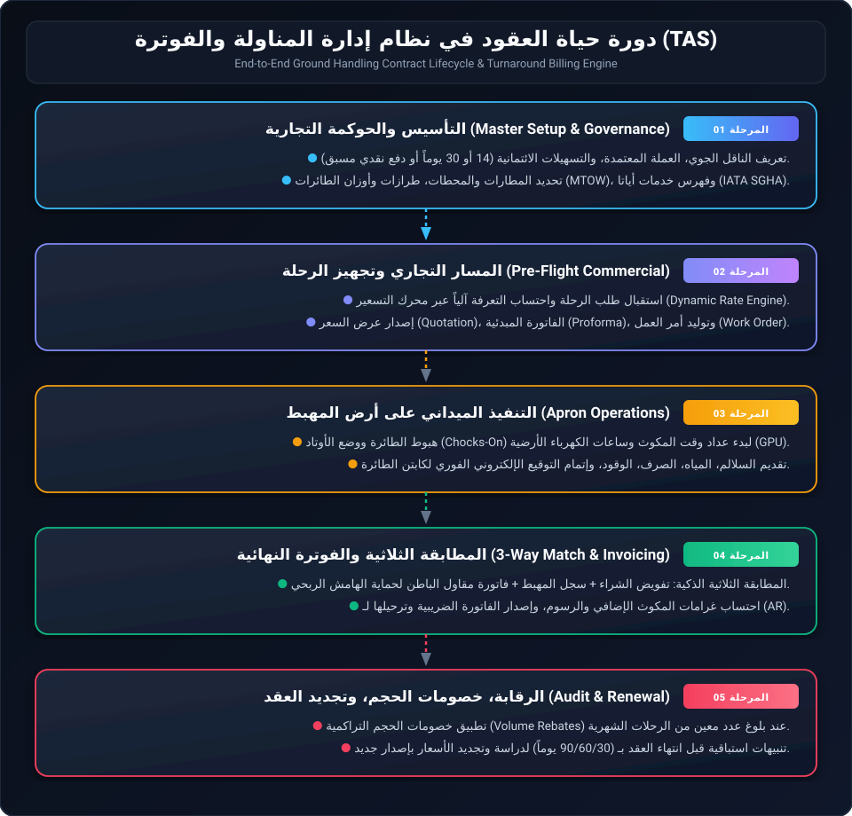
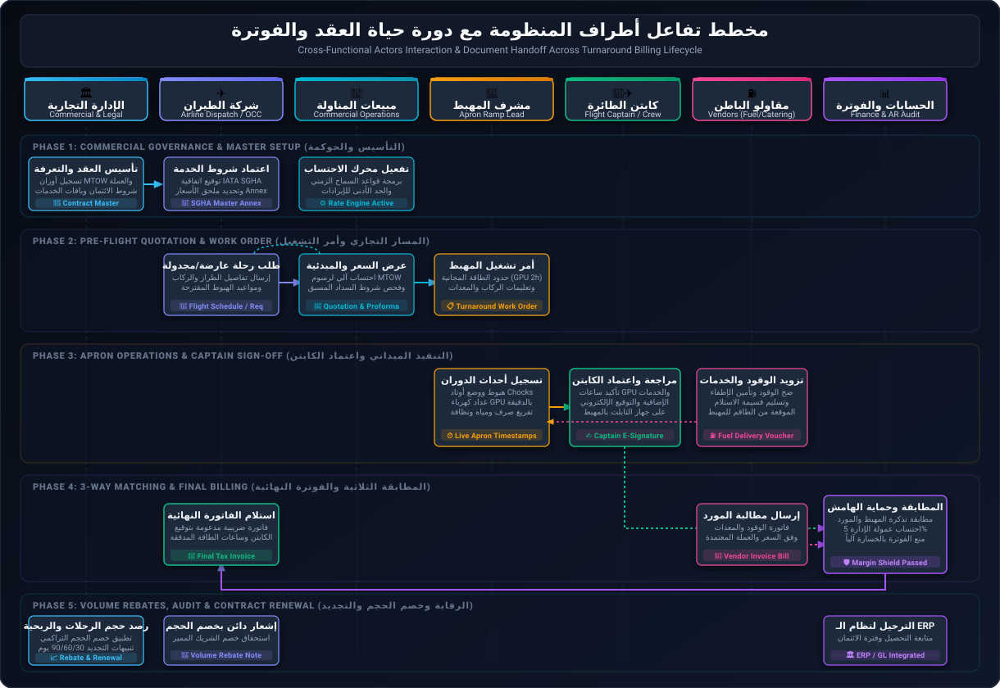
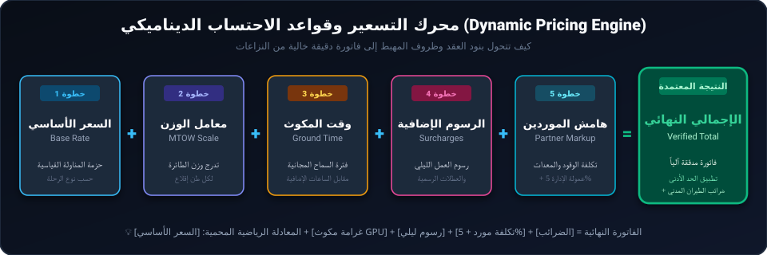
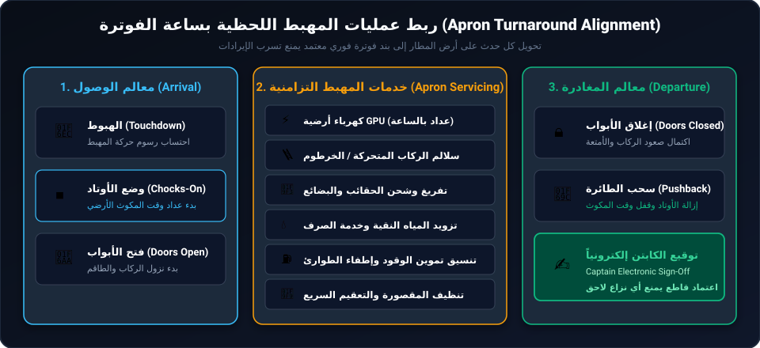
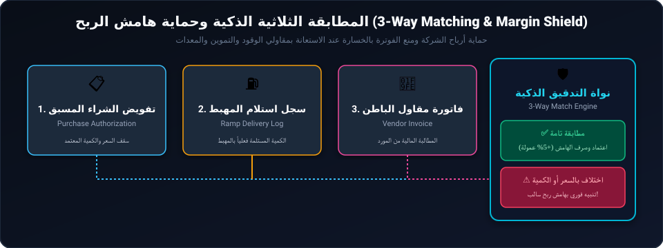

# دليل دورة حياة العقود في نظام إدارة المناولة الأرضية والفوترة (TAS)
## Ground Handling Contract Management & Turnaround Billing Lifecycle Guide

---

## 📌 مقدمة عامة (Executive Overview)

في أنظمة المناولة الأرضية لشركات الطيران (**Aviation Ground Handling**)، لا يُمثّل العقد مجرد وثيقة قانونية أرشيفية، بل هو **محرك حسابي وتشغيلي تفاعلي (Active Calculation Engine)** يربط بين:
1. **الالتزامات التجارية المسبقة** مع شركات الطيران.
2. **العمليات الميدانية على أرض المهبط (Apron / Ramp Operations)** بكل تفاصيلها اللحظية.
3. **الفوترة الدقيقة وضمان الإيرادات (Revenue Assurance)** لحماية هوامش الربح التشغيلية من أي تسرب للخدمات (**Service Leakage**).

---

## 🗺️ المخطط العام الشامل: دورة حياة العقد من البداية للنهاية



---

## 👥 مخطط تفاعل أطراف المنظومة مع دورة حياة العقد (Actors Interaction Workflow Matrix)

يوضح المخطط التالي كيفية تفاعل الفاعلين الأساسيين (من الإدارة التجارية، وشركة الطيران، وفريق مبيعات العمليات، ومشرف المهبط، وكابتن الطائرة، ومقاولي الباطن، وإدارة الحسابات والفوترة) وتبادل الوثائق الرقمية والرموز التشغيلية عبر مراحل العقد:



### مصفوفة أدوار الفاعلين والتسليم الرقمي بين المراحل (Cross-Functional RACI & Interaction Matrix)

| الفاعل / الطرف (Actor) | الواجهة البرمجية المعتمدة | المدخلات والمشغلات (Inputs & Triggers) | العمليات البرمجية والتحقق (Business Rules) | المخرجات الرقمية المستلمة/المسلمة (Outputs & Deliverables) | دوره في حماية الإيراد ومنع التسرب |
| :--- | :--- | :--- | :--- | :--- | :--- |
| **🏛️ الإدارة التجارية والقانونية**<br>`Commercial & Legal` | بوابة العقود والحوكمة (`CLM Web Portal`) | مسودة الاتفاقية، كشوف أوزان الأسطول (MTOW)، بنود IATA SGHA | تطبيق مصفوفة الاعتماد، تقييم شروط الائتمان (Pre-flight Cash vs Net-30) | ملف عقد رئيسي معتمد (`Contract Master`) + شروط الدفع والأسعار | منع تقديم أي خدمة تجارية بدون غطاء تعاقدي سارٍ وموثق. |
| **✈️ شركة الطيران والمرحل الجوي**<br>`Airline OCC & Dispatch` | بوابة العميل للخدمة الذاتية أو الربط الآلي (`Customer Portal / API`) | طلب رحلة مجدولة أو عارضة (طراز الطائرة، عدد الركاب، جدول الرحلات) | مراجعة واعتماد عروض الأسعار، سداد الفاتورة المبدئية للرحلات العارضة | أمر تأكيد الرحلة + موافقة عرض السعر (`Approved Quotation`) | الالتزام المالي المسبق قبل إقلاع الطائرة باتجاه محطة الوصول. |
| **💼 إدارة المبيعات وتنسيق العمليات**<br>`Commercial Sales & Dispatch` | محرك التسعير وإصدار أوامر العمل (`TAS Commercial Engine`) | إشعار طلب الرحلة المعتمد، بيانات المطار وتاريخ التشغيل | احتساب تسعير MTOW، هوامش الربح، وفحص سقف الائتمان للناقل | إصدار عرض السعر (`Quotation`)، الفاتورة المبدئية (`Proforma`)، وأمر تشغيل المهبط (`Work Order`) | تحويل بنود العقد إلى محددات تشغيل صارمة تمنع التجاوز بالمطار. |
| **🦺 مشرف ساحة الطيران (المهبط)**<br>`Apron Ramp Lead` | تطبيق الأجهزة اللوحية الميدانية (`Ramp Mobile App`) | أمر التشغيل (`Work Order`) + إشعار وصول الطائرة وهبوطها | تسجيل التوقيتات بالدقيقة (Chocks, GPU, Water, Pushback) وتسجيل الخدمات الإضافية | كشف خدمات المهبط الإلكتروني (`Turnaround Service Sheet`) | القضاء التام على الخدمات غير المسجلة ومراقبة استهلاك الطاقة. |
| **🧑‍✈️ كابتن الطائرة وطاقم الرحلة**<br>`Flight Captain & Crew` | لوحة التوقيع الرقمي بالتابلت (`Captain Digital Pad`) | طلب خدمات إضافية على المهبط (ASU, تنظيف إضافي، ساعات تكييف إضافية) | تدقيق فترات تشغيل المعدات ومطابقتها مع الواقع الفعلي قبل الإقلاع | التوقيع الإلكتروني الحي (`Captain Electronic Sign-off`) | قطع الطريق تماماً على أي اعتراضات أو نزاعات مالية لاحقة بنسبة 80%. |
| **⛽ مقاولو الباطن (الوقود والتموين)**<br>`Subcontractors & Vendors` | نظام تسليم الإيصالات وبوابة الموردين (`Vendor Portal / Field Log`) | أمر تقديم الوقود / التموين المصاحب لأمر التشغيل | تزويد الطائرة، تسجيل قراءات العدادات، وتسليم إيصال الاستلام | قسيمة تسليم ميدانية موقعة (`Delivery Voucher`) + فاتورة المورد (`Vendor Bill`) | ضمان تسجيل التكلفة الفعلية فوراً وتفادي الارتفاعات المفاجئة للأسعار. |
| **📊 مراجع الحسابات والفوترة والـ ERP**<br>`Finance & Revenue Assurance` | محرك الفوترة والربط المالي (`Billing & ERP Engine`) | كشف خدمات الكابتن + إيصالات الموردين + شروط العقد | المطابقة الثلاثية الذكية، فحص حائط صد الهامش السالب (Margin Shield 5%) | الفاتورة الضريبية النهائية (`Final Tax Invoice`) + ترحيل قيود المدينين للـ ERP | حماية هامش الربح ومنع الفوترة بالخسارة وتسريع دورة التحصيل DSO. |
| **📈 الإدارة العليا وإدارة المحطة**<br>`Executive & Station Leadership` | لوحة مؤشرات الأداء والتحليلات (`Executive Analytics Dashboard`) | بيانات الرحلات الشهرية المنفذة والإيرادات والتكاليف | تتبع الوصول لأسقف الحجم (`Volume Thresholds`)، وتحليل ربحية الدوران | إصدار إشعارات دائنة لخصم الحجم (`Volume Rebate`) + بدء مفاوضات التجديد | تعظيم القيمة الاستراتيجية للعملاء والتجديد الاستباقي قبل انتهاء العقود. |

---

### ملخص المسار التدفقي للمراحل الخمس (Lifecycle Phases Summary)

| المرحلة | الهدف التشغيلي والتجاري | المسؤول | النتيجة الملموسة |
| :--- | :--- | :--- | :--- |
| **1. التأسيس والحوكمة التجارية** | تسجيل بيانات الناقل، أوزان الطائرات (MTOW)، وشروط الائتمان | الإدارة التجارية | ملف عقد رئيسي نشط ومعتمد (`Contract Master`) |
| **2. المسار التجاري وتجهيز الرحلة** | احتساب التكاليف آلياً وإصدار عروض الأسعار والفاتورة المبدئية | إدارة المبيعات | أمر تشغيل معتمد للمهبط (`Turnaround Work Order`) |
| **3. التنفيذ الميداني على المهبط** | تسجيل ساعات الـ GPU والخدمات الفعلية واعتماد الكابتن | مشرف المهبط والكابتن | كشف خدمات موقع إلكترونياً (`Captain Sign-off`) |
| **4. المطابقة الثلاثية والفوترة** | مطابقة فواتير موردي الوقود والمعدات وحماية الهامش الربحي | الحسابات والتدقيق | فاتورة ضريبية نهائية مدققة (`Final Tax Invoice`) |
| **5. الرقابة وتجديد العقد** | تطبيق خصومات الحجم وتحليل ربحية الدوران وتنبيهات التجديد | الإدارة العليا | إصدار ملحق موسمي أو تجديد العقد (`Renewal`) |

---

## 📑 الشرح التفصيلي لمراحل دورة حياة العقد

---

### المرحلة 1: التأسيس والحوكمة التجارية (Master Setup & Governance)

في هذه المرحلة، يتم تحويل الاتفاق التجاري المبرم بين المناول الأرضي وشركة الطيران إلى قواعد برمجية ملزمة:

#### 1. ملف تعريف الناقل والائتمان (Carrier Profile & Credit Terms)
* تسجيل الرمز التجاري لشركة الطيران (`CustomerCode` و `AirlineCode`).
* تحديد شروط السداد (مثال: دفع نقدي مسبق للرحلات العارضة، أو ائتمان 14/30 يوماً للرحلات المجدولة المنتظمة).
* تحديد العملة التعاقدية (`CurrencyCode` مثل USD أو EUR أو التوطين بالعملة المحلية).

#### 2. نطاق المحطات والمطارات (Stations & Airports Scope)
* ربط العقد بالمطارات المعتمدة (`AirportCode` / `AirportGroupCode`) كالقاهرة، الغردقة، شرم الشيخ، وغيرها.
* تصنيف حركة الطيران المصرح بها:
  * **Scheduled**: رحلات تجارية مجدولة.
  * **Charter**: رحلات سياحية / عارضة غير منتظمة.
  * **Cargo**: رحلات شحن بضائع بحتة.
  * **Technical Stop**: هبوط فني للتزود بالوقود فقط دون تبديل ركاب.

#### 3. مصفوفة أوزان الطائرات وهيكلها (Aircraft MTOW & Body Categories)
* ربط طراز الطائرة (`ModelCode`) بوزن الإقلاع الأقصى (**MTOW** - Maximum Take-Off Weight)، وهو الأساس المعتمد دولياً في تسعير المناولة.
* تصنيف البدن (`BodyTypeCode`):
  * **Narrow-body (بدن ضيق)**: مسموح بمدة مكوث أرضي قياسية (مثلاً 60 دقيقة).
  * **Wide-body (بدن عريض)**: مسموح بمدة مكوث أرضي قياسية (مثلاً 90 إلى 120 دقيقة).

#### 4. فهرس الخدمات الدولي (IATA SGHA Service Catalog)
هيكلة جميع الخدمات وفق معايير الاتحاد الدولي للنقل الجوي (IATA SGHA):
* **خدمات ساحة الطيران (Ramp Operations)**: إرشاد الطائرة، وضع وسحب الأوتاد، الدفع للخلف (Pushback).
* **خدمات الطاقة والتكييف**: تزويد الطائرة بالكهرباء الأرضية (**GPU**) أو بادئ تشغيل الهواء (**ASU**) وتحسب بنظام النصف ساعة أو الساعة.
* **خدمات الركاب والصعود**: السلالم المتحركة (Passenger Stairs)، الخراطيم (Jet Bridges)، حافلات النقل.
* **خدمات المقصورة والمرافق**: مياه الشرب النقية (Potable Water)، تفريغ ومعالجة الصرف (Lavatory Waste)، والنظافة السريعة للعبور (Transit Cleaning).
* **تنسيق الوقود والطرف الثالث**: ربط مقاولي تزويد الوقود وسيارات إطفاء الطوارئ.

#### 5. إدارة الإصدارات وتاريخ الصلاحية (Contract Versioning & Validity)
* تسجيل تاريخ البداية والنهاية.
* إمكانية تعديل الأسعار عبر ملحق موسمي (**Seasonal Amendment**) مع الاحتفاظ بالإصدارات السابقة في السجل التاريخي دون حذفها للتدقيق القانوني والمالي.

---

### المرحلة 2: محرك التسعير وقواعد الاحتساب الديناميكي (Dynamic Rate Engine)

تعتمد الفوترة داخل النظام على محرك حسابات يمر بـ 6 خطوات رئيسية لحماية الهامش الربحي:



* **السماح الزمني (Time Tolerance)**: العقد يمنح وقتاً أرضياً مجانياً (مثلاً أول ساعتين مجاناً)، وفي حال تأخر إقلاع الطائرة يبدأ النظام في احتساب غرامات المكوث الإضافي تلقائياً مجزأة لكل نصف ساعة.
* **ضمان الحد الأدنى للإيراد (Minimum Price Guarantee)**: قاعدة تضمن أن أي رحلة، حتى لو كانت بحمولة منخفضة، لا تقل إيراداتها عن رقم أدنى يغطي تكاليف تشغيل العمالة والمعدات.
* **الرسوم الإضافية (Surcharges)**: رسوم العمل الليلي والعطلات الرسمية والأعياد.

---

### المرحلة 3: المسار التجاري القبلي (From Quotation to Work Order)

```
[ طلب الرحلة من العميل ]
          │
          ▼
[ إنشاء عرض السعر (Quotation) ] ───► يشمل: الخدمات المطلوبة، الطراز، الركاب، والتسعير
          │
          ▼
[ إصدار الفاتورة المبدئية (Proforma Invoice) ] ───► للرحلات العارضة للتحقق من السداد المسبق
          │
          ▼
[ اعتماد العميل وتوليد أمر العمل (Work Order) ] ───► وثيقة رسمية تنزل لمهبط المطار
```

1. **عرض السعر (`Com_QuotationHeader / Com_QuotationDetails`)**:
   تجميع بيانات الرحلة بالكامل، متضمنة عدد الركاب القادمين والمغادرين (`IPAXIn, IPAXOut, DPAXIn, DPAXOut`)، ونوع الحمولة (`LoadTypeCode`).
2. **الفاتورة المبدئية (`Quotation Performa`)**:
   تُلزم عملاء الرحلات غير المنتظمة بالتحويل البنكي المسبق قبل إعطاء تصريح الهبوط.
3. **أمر العمل التشغيلي (`Turnaround Work Order`)**:
   تحويل بنود العقد إلى قائمة مهام ملموسة لطاقم المهبط توضح بالتحديد:
   * المعدات المصرح باستخدامها وعدد الساعات المشمولة مجاناً (مثلاً: GPU لمدة ساعتين فقط؛ سلم ركاب واحد).
   * التنبيهات الخاصة (شحنات خطرة، ركاب VIP، إلخ).

---

### المرحلة 4: التنفيذ الميداني على أرض المهبط (Apron Operations Alignment)

المرحلة التي تضمن عدم ضياع أي خدمة تقدم فعلياً على أرض الواقع:



* **وحدات الطاقة الأرضية (`GPU`)**: تُحسب بالدقيقة وتُسجل بساعات التشغيل من لحظة التوصيل إلى لحظة الفصل.
* **الخدمات الإضافية الميدانية (Ad-Hoc Services)**: في حال طلب طاقم الطائرة خدمات طارئة (مثل تنظيف إضافي، عربة حقائب إضافية، أو وحدة تشغيل هواء ASU)، يتم تسجيلها فورياً في السجل الميداني.
* **التوقيع الإلكتروني للكابتن (`Captain Electronic Sign-Off`)**:
  قبل سحب الأوتاد والإقلاع، يعتمد قائد الطائرة بياناً إلكترونياً بما استهلكته طائرته من خدمات وساعات طاقة ومياه وتنظيف، وهو ما يقطع الطريق تماماً على أي اعتراضات لاحقة من إدارة الحسابات في شركة الطيران.

---

### المرحلة 5: إدارة مقاولي الباطن والمطابقة الثلاثية (Subcontractor & Margin Protection)

تعتمد شركات المناولة الأرضية على مقاولين خارجيين لتوفير خدمات معينة (مثل الوقود، التموين، أو الرافعات الثقيلة). لحماية الهامش الربحي:



* **حائط صد الهامش السالب (`Negative Margin Alert`)**:
  النظام يمنع إصدار الفاتورة أو قبول فاتورة المورد إذا كانت تكلفة المورد أعلى من السعر المتفق عليه مع شركة الطيران، مما يضمن أن نسبة الـ **Disbursement Fee** أو الـ **Markup** الخاصة بالشركة تظل مضمونة دائماً.
* **مثال عملي على حماية الهامش**:
  * فاتورة الوقود المفوترة على شركة الطيران: **$1,200.00**
  * تكلفة المورد الأساسية: **-$980.00**
  * عمولة إدارة ومناولة (5% Disbursement Markup): **+$60.00**
  * **صافي ربح المناول الأرضي:** **$280.00** (محمية ومضمونة).

---

### المرحلة 6: المراجعة المالية وإصدار الفاتورة الختامية (Final Tax Invoicing)

1. **احتساب الفروقات (`Variance Analysis`)**:
   مقارنة ما تم تسعيره مبدئياً في عرض السعر بما استهلكه الكابتن فعلياً على أرض المهبط (مثال: طلب ساعة إضافية من الـ GPU أو سيارة تفريغ إضافية).
2. **إصدار الفاتورة الضريبية النهائية (`Final Tax Invoice`)**:
   تتضمن الأرقام الحسابية الشفافة:
   * السعر الأساسي للمناولة (Handling Base).
   * رسوم المكوث الإضافي إن وجدت (Overtime Parking).
   * رسوم الخدمات الإضافية الميدانية (Extra Services).
   * رسوم الطرف الثالث ومصاريف الإدارة (Third-party & Disbursement).
   * رسوم سلطة الطيران المدني والضرائب الحكومية المطبقة (`AirportTax`).
3. **الترحيل إلى نظام المدينين (`Accounts Receivable - AR / ERP`)**:
   ترحيل الفاتورة مباشرة إلى الحسابات لمتابعة السداد والتحصيل وفق مدة الائتمان المقررة في العقد.

---

### المرحلة 7: الرقابة والتحليلات وتجديد العقد (Audit, Rebates & Renewal)

```
[ رصد عدد الرحلات المنفذة شهرياً ]
               │
               ▼
[ هل تحققت أهداف الحجم؟ Volume Threshold ]
        ├── نعم ──► تطبيق خصم الحجم تلقائياً (Volume Rebate)
        └── لا  ──► استمرار التعرفة القياسية
               │
               ▼
[ تحليل العائد والربحية لكل دوران طائرة Yield Analysis ]
               │
               ▼
[ إرسال تنبيهات التجديد قبل انتهاء العقد بـ 90 / 60 / 30 يوماً ]
               │
               ▼
[ مفاوضات التجديد وتحديث الأسعار وإصدار ملحق جديد للموسم ]
```

* **خصومات الحجم التراكمية (`Volume Rebates`)**:
  يقوم النظام آلياً برصد عدد الرحلات المنفذة شهرياً (`FlightCount`). وعند وصول الناقل إلى سقف معين محدد في العقد (مثال: أكثر من 40 رحلة شهرياً)، يُطبق خصم الحجم على الفواتير التالية أو في صورة إشعار دائن (Credit Note).
* **إشعارات التجديد الاستباقية**:
  تنبيه مسؤولي الإدارة التجارية قبل انتهاء صلاحية العقد بوقت كافٍ (90، 60، 30 يوماً) لإعادة التفاوض وتعديل الأسعار وتجديد العقد بسلاسة.

---

## 🗃️ مصفوفة الوثائق والبيانات البرمجية لكل مرحلة

| المرحلة | الوثيقة المرتبطة في النظام | الجداول والحقول البرمجية (Database & Models) | المسؤول |
| :--- | :--- | :--- | :--- |
| **1. التأسيس** | `Contract Master File` | `ContractID`, `CustomerCode`, `AirportCode`, `MTOW`, `StanderPrice` | المدير التجاري / القانوني |
| **2. قبل الرحلة** | `Price Quotation / Proforma` | `Com_QuotationHeader`, `Com_QuotationDetails`, `MinimumPrice` | مسؤول المبيعات التجارية |
| **3. أمر التشغيل** | `Turnaround Work Order` | `WorkOrderID`, `TimeInclude`, `LoadTypeCode`, `FlightTypeCode` | منسق العمليات |
| **4. المهبط** | `Turnaround Service Sheet` | `GroundTime`, `LandingTime`, `ParkingTime`, `ServiceQuantity`, `Hours` | مشرف المهبط + كابتن الطائرة |
| **5. الموردين** | `Subcontractor Reconcile` | `SupplierCode`, `SupplierPrice`, `SupplierCurrencyCode`, `Disbursement` | مسؤول المشتريات / التدقيق |
| **6. الفاتورة** | `Final Tax Invoice` | `PriceTotal`, `AirportTax`, `DiscountPercentage`, `SureCharge` | المحاسب المالي / الفوترة |
| **7. التجديد** | `Contract Renewal / Rebate` | `FlightCount`, `PackagePrice`, `ExpiryDate`, `VersionNumber` | الإدارة التجارية العليا |

---

## 💎 الفوائد التشغيلية والمالية لنظام العقود (Core Business Value)

1. **منع تسرب الإيرادات (Zero Service Leakage)**: تحويل كل دقيقة تشغيل للمعدات وخدمات المهبط إلى بنود مالية مفوترة دون إهمال أي طلب ميداني.
2. **حماية هوامش الربح مع الموردين (Margin Protection)**: منع الفوترة بالخسارة عبر المطابقة الثلاثية الآلية بين عروض الأسعار وفواتير موردي الوقود والمعدات.
3. **تقليص نزاعات شركات الطيران بنسبة 80%**: بفضل التوقيع الإلكتروني الفوري لقائد الطائرة والشفافية التامة في عرض معادلات الاحتساب.
4. **تسريع التحصيل المالي (Reduced DSO)**: إصدار الفواتير فور مغادرة الطائرة بدلاً من استغراق أسابيع في تدقيق المستندات الورقية.

---
*تم إعداد وتوثيق هذا الدليل للرجوع إليه كمرجع رئيسي لدورة حياة العقود في نظام TAS.*
