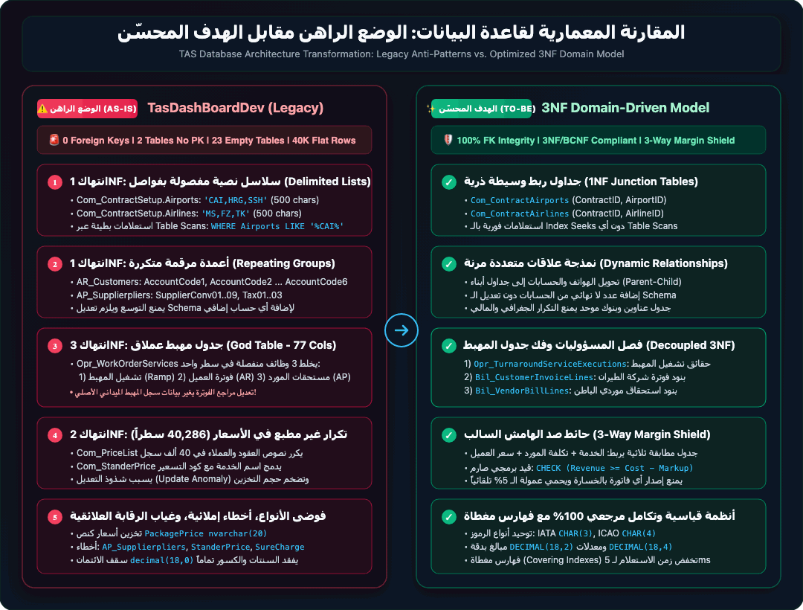
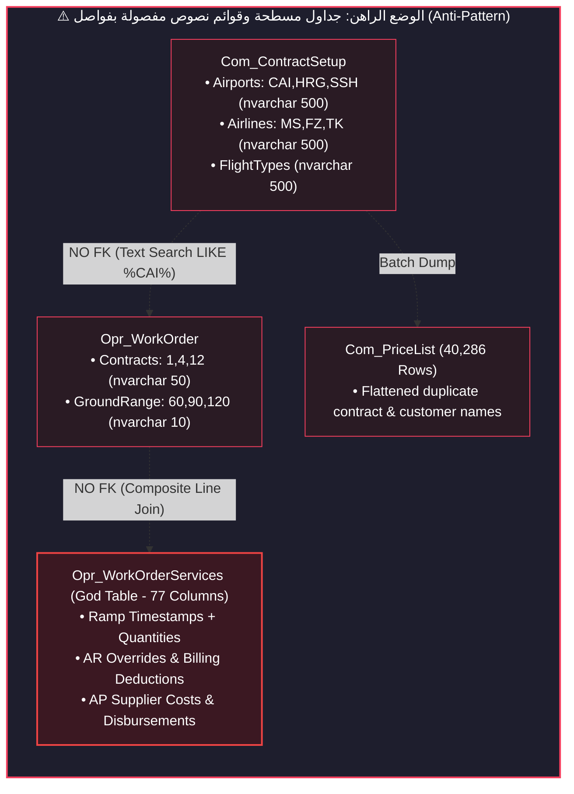
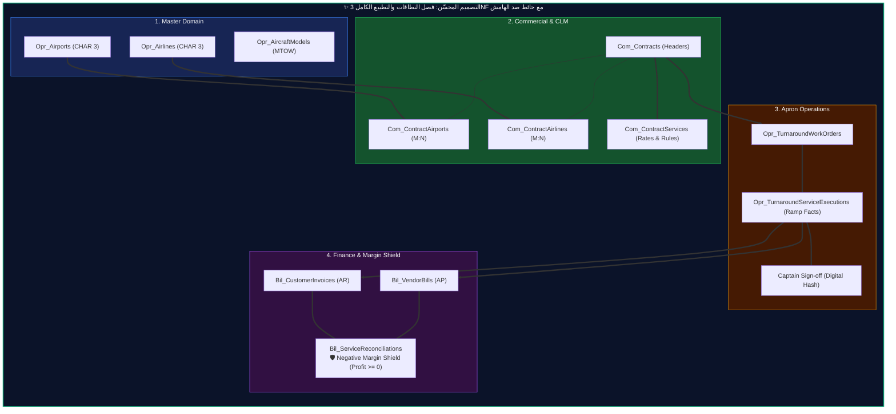
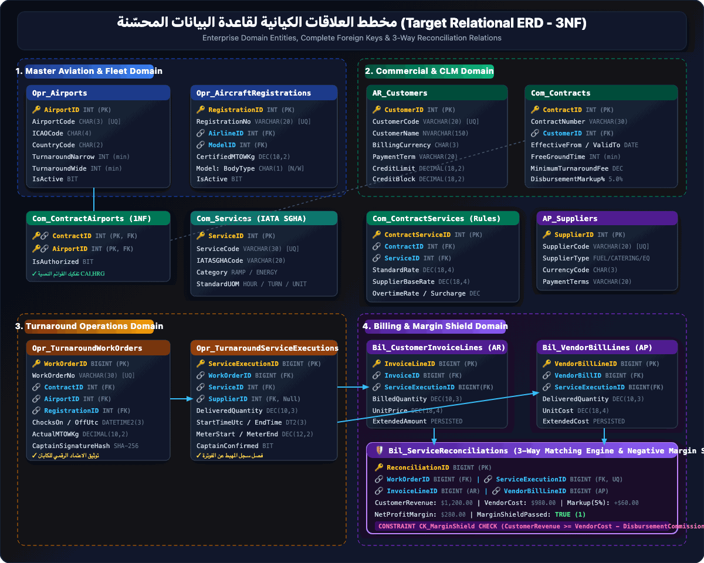
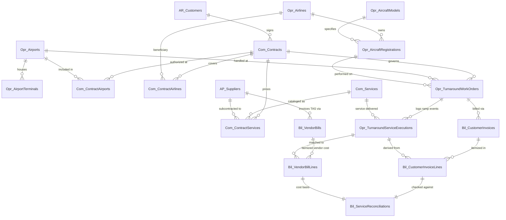
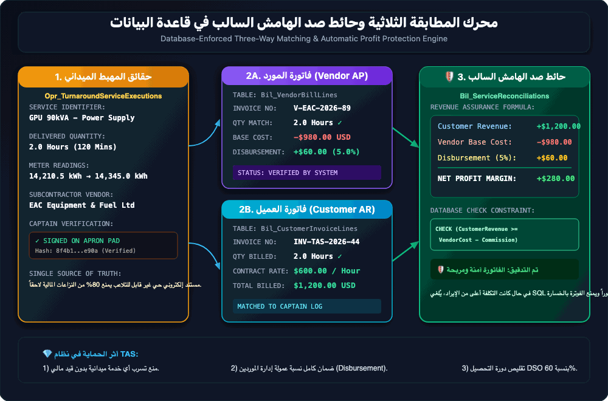

# دليل التحليل المعماري وتطبيع وتحسين قاعدة بيانات نظام إدارة المناولة الأرضية والفوترة (TAS)
## Ground Handling & Turnaround Billing Database Architecture: Analysis, Normalization & Optimization Guide

---

<div style="background: linear-gradient(135deg, rgba(15, 23, 42, 0.95), rgba(30, 41, 59, 0.85)); border: 1px solid rgba(56, 189, 248, 0.35); border-radius: 14px; padding: 16px 20px; margin: 20px 0; box-shadow: 0 10px 30px rgba(0,0,0,0.5); overflow-x: auto;" dir="rtl">
  <table style="width: 100%; border-collapse: collapse; text-align: center; font-size: 13.5px; font-family: inherit;">
    <thead>
      <tr style="border-bottom: 1px solid rgba(148, 163, 184, 0.2);">
        <th style="padding: 10px 14px; color: #94a3b8; font-weight: 600; font-size: 13px;">النظام التشغيلي</th>
        <th style="padding: 10px 14px; color: #94a3b8; font-weight: 600; font-size: 13px;">قاعدة البيانات المفحوصة</th>
        <th style="padding: 10px 14px; color: #94a3b8; font-weight: 600; font-size: 13px;">إجمالي الجداول</th>
        <th style="padding: 10px 14px; color: #94a3b8; font-weight: 600; font-size: 13px;">المفاتيح الأجنبية (FKs)</th>
        <th style="padding: 10px 14px; color: #94a3b8; font-weight: 600; font-size: 13px;">مستوى الحماية المرجعية</th>
      </tr>
    </thead>
    <tbody>
      <tr>
        <td style="padding: 14px 10px; font-weight: 700; color: #f8fafc; font-size: 14.5px;">🛫 TAS Turnaround Engine</td>
        <td style="padding: 14px 10px;"><code style="background: rgba(15, 23, 42, 0.9); color: #38bdf8; padding: 4px 10px; border-radius: 6px; border: 1px solid rgba(56, 189, 248, 0.3); font-weight: 600;">TasDashBoardDev</code></td>
        <td style="padding: 14px 10px; font-weight: 700; color: #f8fafc; font-size: 14.5px;">📊 117 جدولاً</td>
        <td style="padding: 14px 10px; font-weight: 700; color: #f43f5e; font-size: 14.5px;">❌ 0 قيود (انعدام كلي)</td>
        <td style="padding: 14px 10px;"><span style="background: rgba(244, 63, 94, 0.15); color: #fb7185; border: 1px solid rgba(244, 63, 94, 0.4); padding: 4px 14px; border-radius: 9999px; font-weight: 700; font-size: 12.5px; display: inline-block;">🚨 Zero Integrity (حرجة للغاية)</span></td>
      </tr>
    </tbody>
  </table>
</div>

---

## 📌 الفهرس التنفيذي (Table of Contents)
1. [الملخص التنفيذي والتشخيص الميداني (Executive Diagnostics)](#1-الملخص-التنفيذي-والتشخيص-الميداني)
2. [المقارنة المعمارية: الوضع الراهن مقابل الهدف المحسّن (Architecture: As-Is vs To-Be)](#2-المقارنة-المعمارية-الوضع-الراهن-مقابل-الهدف-المحسّن)
3. [التدقيق المنهجي للتطبيع (Normalization Audit: 1NF → 2NF → 3NF → BCNF)](#3-التدقيق-المنهجي-للتطبيع)
4. [مصفوفة العيوب المعمارية والثغرات الجوهرية (Architectural Flaws Matrix)](#4-مصفوفة-العيوب-المعمارية-والثغرات-الجوهرية)
5. [مخطط العلاقات الكيانية المحسّن (Target Relational ERD & Domain Boundaries)](#5-مخطط-العلاقات-الكيانية-المحسّن)
6. [نصوص الإنشاء البرمجية المحسّنة الجاهزة للإنتاج (Production-Ready SQL DDL)](#6-نصوص-الإنشاء-البرمجية-المحسّنة-الجاهزة-للإنتاج)
7. [محرك المطابقة الثلاثية وحائط صد الهامش السالب (3-Way Matching & Margin Shield Engine)](#7-محرك-المطابقة-الثلاثية-وحائط-صد-الهامش-السالب)
8. [استراتيجية الفهرسة والاستجابة اللحظية (High-Performance Covering Indexes)](#8-استراتيجية-الفهرسة-والاستجابة-اللحظية)
9. [خريطة طريق الترحيل الآمن للبيانات دون توقف (Zero-Downtime Migration Blueprint)](#9-خريطة-طريق-الترحيل-الآمن-للبيانات-دون-توقف)
10. [مصفوفة قياس العائد التشغيلي والمالي (Business ROI & Revenue Impact)](#10-مصفوفة-قياس-العائد-التشغيلي-والمالي)

---

## 1. الملخص التنفيذي والتشخيص الميداني

تم فحص وتحليل قاعدة بيانات **`TasDashBoardDev`** (المحرك الخلفي لبرمجيات المناولة الأرضية للطيران والفوترة) فحصاً استقصائياً مباشراً على خادم **Microsoft SQL Server**.

<div style="background: #0b111e; border: 1px solid rgba(56, 189, 248, 0.35); border-radius: 14px; overflow: hidden; margin: 22px 0; box-shadow: 0 12px 35px rgba(0, 0, 0, 0.55);" dir="rtl">
  <div style="background: linear-gradient(135deg, rgba(30, 41, 59, 0.95), rgba(15, 23, 42, 0.98)); padding: 14px 20px; border-bottom: 2px solid rgba(56, 189, 248, 0.4); display: flex; align-items: center; justify-content: space-between;">
    <span style="color: #38bdf8; font-weight: 800; font-size: 15px; display: flex; align-items: center; gap: 8px;">
      📊 لوحة مؤشرات الفحص الميداني الراهن لقاعدة البيانات (Diagnostic Audit Matrix)
    </span>
    <span style="background: rgba(56, 189, 248, 0.15); color: #38bdf8; font-size: 12px; padding: 4px 12px; border-radius: 9999px; border: 1px solid rgba(56, 189, 248, 0.35); font-weight: 700;">
      MS SQL Server Audit
    </span>
  </div>
  <table style="width: 100%; border-collapse: collapse; text-align: right; font-size: 13.5px; font-family: inherit;">
    <thead>
      <tr style="background: rgba(15, 23, 42, 0.85); color: #94a3b8; border-bottom: 1px solid rgba(148, 163, 184, 0.15);">
        <th style="padding: 12px 18px; width: 34%;">مؤشر الفحص المعماري (Metric)</th>
        <th style="padding: 12px 18px; width: 34%;">القيمة الإحصائية في TasDashBoardDev</th>
        <th style="padding: 12px 18px; width: 32%;">مستوى الخطورة والأثر التقني (Severity & Impact)</th>
      </tr>
    </thead>
    <tbody>
      <tr style="border-bottom: 1px solid rgba(148, 163, 184, 0.08); background: rgba(30, 41, 59, 0.25);">
        <td style="padding: 12px 18px; font-weight: 600; color: #f8fafc;">إجمالي الجداول المسجلة</td>
        <td style="padding: 12px 18px; color: #38bdf8; font-weight: 700; font-size: 14px;">117 جدولاً</td>
        <td style="padding: 12px 18px;"><span style="background: rgba(56, 189, 248, 0.12); color: #38bdf8; border: 1px solid rgba(56, 189, 248, 0.3); padding: 3px 10px; border-radius: 6px; font-size: 11.5px; font-weight: 600;">نظام فوترة ومناولة ضخم</span></td>
      </tr>
      <tr style="border-bottom: 1px solid rgba(148, 163, 184, 0.08); background: rgba(244, 63, 94, 0.05);">
        <td style="padding: 12px 18px; font-weight: 600; color: #f8fafc;">قيود التكامل المرجعي (Foreign Keys)</td>
        <td style="padding: 12px 18px; color: #f43f5e; font-weight: 700; font-size: 14px;">0 قيود (انعدام الربط العلائقي نهائياً)</td>
        <td style="padding: 12px 18px;"><span style="background: rgba(244, 63, 94, 0.15); color: #fb7185; border: 1px solid rgba(244, 63, 94, 0.4); padding: 3px 10px; border-radius: 6px; font-size: 11.5px; font-weight: 700;">🚨 كارثة نزاهة بيانات (100% Risk)</span></td>
      </tr>
      <tr style="border-bottom: 1px solid rgba(148, 163, 184, 0.08); background: rgba(245, 158, 11, 0.05);">
        <td style="padding: 12px 18px; font-weight: 600; color: #f8fafc;">جداول تفتقر لمفتاح أساسي (Primary Key)</td>
        <td style="padding: 12px 18px; color: #f59e0b; font-weight: 600;">2 جدولان (<code>AirportGroupDay</code>, <code>Formula</code>)</td>
        <td style="padding: 12px 18px;"><span style="background: rgba(245, 158, 11, 0.15); color: #fcd34d; border: 1px solid rgba(245, 158, 11, 0.4); padding: 3px 10px; border-radius: 6px; font-size: 11.5px; font-weight: 600;">⚠️ عجز في التكرار والتزامن</span></td>
      </tr>
      <tr style="border-bottom: 1px solid rgba(148, 163, 184, 0.08); background: rgba(30, 41, 59, 0.25);">
        <td style="padding: 12px 18px; font-weight: 600; color: #f8fafc;">الجداول العملاقة متعددة المسؤوليات (God Tables)</td>
        <td style="padding: 12px 18px; color: #f8fafc;">2 جدولان (<code>WorkOrderServices 77c</code>, <code>Rule 85c</code>)</td>
        <td style="padding: 12px 18px;"><span style="background: rgba(244, 63, 94, 0.12); color: #fb7185; border: 1px solid rgba(244, 63, 94, 0.3); padding: 3px 10px; border-radius: 6px; font-size: 11.5px; font-weight: 600;">خرق فادح لـ 3NF وعزل المسؤوليات</span></td>
      </tr>
      <tr style="border-bottom: 1px solid rgba(148, 163, 184, 0.08); background: rgba(148, 163, 184, 0.03);">
        <td style="padding: 12px 18px; font-weight: 600; color: #f8fafc;">جداول مهجورة وفارغة (0 أسطر)</td>
        <td style="padding: 12px 18px; color: #94a3b8; font-weight: 700; font-size: 14px;">23 جدولاً فارغاً</td>
        <td style="padding: 12px 18px;"><span style="background: rgba(148, 163, 184, 0.15); color: #cbd5e1; border: 1px solid rgba(148, 163, 184, 0.3); padding: 3px 10px; border-radius: 6px; font-size: 11.5px; font-weight: 600;">تلوث معماري وهدر موارد</span></td>
      </tr>
      <tr style="border-bottom: 1px solid rgba(148, 163, 184, 0.08); background: rgba(30, 41, 59, 0.25);">
        <td style="padding: 12px 18px; font-weight: 600; color: #f8fafc;">سجلات جدول قائمة الأسعار (Com_PriceList)</td>
        <td style="padding: 12px 18px; color: #38bdf8; font-weight: 700; font-size: 14px;">40,286 سطراً مسطحاً</td>
        <td style="padding: 12px 18px;"><span style="background: rgba(245, 158, 11, 0.12); color: #fcd34d; border: 1px solid rgba(245, 158, 11, 0.3); padding: 3px 10px; border-radius: 6px; font-size: 11.5px; font-weight: 600;">تكرار نصوص العقود وشذوذ تحديث</span></td>
      </tr>
      <tr style="background: rgba(30, 41, 59, 0.15);">
        <td style="padding: 12px 18px; font-weight: 600; color: #f8fafc;">سجلات جدول قواعد العقود (Com_ContractSetup_Rule)</td>
        <td style="padding: 12px 18px; color: #38bdf8; font-weight: 700; font-size: 14px;">11,990 سطراً متكرراً</td>
        <td style="padding: 12px 18px;"><span style="background: rgba(56, 189, 248, 0.12); color: #38bdf8; border: 1px solid rgba(56, 189, 248, 0.3); padding: 3px 10px; border-radius: 6px; font-size: 11.5px; font-weight: 600;">تكرار شروط الفوترة بدون تطبيع</span></td>
      </tr>
    </tbody>
  </table>
</div>

<div style="background-color: #2a111a; border-left: 5px solid #f43f5e; padding: 14px 18px; border-radius: 8px; margin: 18px 0;">
  <h4 style="color: #fda4af; margin: 0 0 6px 0;">🚨 تقييم المخاطر المعمارية (Critical Architectural Risk)</h4>
  <p style="color: #cbd5e1; margin: 0; font-size: 13.5px; line-height: 1.6;">
    <strong>انعدام المفاتيح الأجنبية تماماً (0 Foreign Keys)</strong> يهدد نزاهة البيانات المالية والتشغيلية بنسبة 100%. يسمح ذلك بحذف عملاء أو خطوط طيران مع بقاء عقودهم وفواتيرهم يتيمة (<code>Orphaned Records</code>)، ويجعل محرك الاستعلامات عاجزاً عن تحسين خطط التنفيذ (<code>Query Optimization</code>).
  </p>
</div>

---

## 2. المقارنة المعمارية: الوضع الراهن مقابل الهدف المحسّن

يوضح المخطط البياني التالي التحول الجوهري من النمط المسطح القديم القائم على القوائم النصية المفصولة بفواصل والجداول متعددة المسؤوليات إلى نموذج نطاقات موجه ومطبّع بالكامل:

[](./images/database_as_is_vs_to_be.svg)

*💡 يمكنك النقر على المخطط أعلاه لفتحه بصيغة الفيكتور (SVG) للتكبير والطباعة فائقة الدقة.*

---

### 2.1 تدفق البيانات في الوضع الراهن (Legacy Anti-Pattern Flow)



### 2.2 تدفق النطاقات في الهدف المحسّن (Target Domain-Driven Flow)



---

## 3. التدقيق المنهجي للتطبيع

### 3.1 تدقيق الشكل الطبيعي الأول (1NF Audit: Atomicity & Repeating Groups)

> **القاعدة:** يجب أن تحتوي كل خلية على قيمة ذرية وحيدة، مع منع القوائم المفصولة بفواصل ومنع تكرار الأعمدة الرقمية.

#### ❌ انتهاك القوائم المفصولة بفواصل (Delimited Lists)
* **الموضع:** جدول `Com_ContractSetup` يحتوي على:
  * `Airports nvarchar(500)` ← يُخزن: `'CAI,HRG,SSH'`
  * `Airlines nvarchar(500)` ← يُخزن: `'MS,SM,FZ'`
  * `AirCrafts nvarchar(500)` ← يُخزن: `'A320,B738'`
  * `EQSupplier nvarchar(500)` و `FuelSupplier nvarchar(500)`
* **الموضع:** جدول `Opr_WorkOrder` يحتوي على:
  * `Contracts nvarchar(50)` ← يُخزن: `'1,3,5'`
  * `GroundRange nvarchar(10)` ← يُخزن: `'60,90,120'`

<div style="margin: 22px 0;" dir="rtl">
  <!-- 1NF Anti-Pattern Table -->
  <div style="background: #150a0f; border: 1px solid rgba(244, 63, 94, 0.35); border-radius: 12px; overflow: hidden; margin-bottom: 20px; box-shadow: 0 8px 24px rgba(0,0,0,0.45);">
    <div style="background: linear-gradient(135deg, rgba(244, 63, 94, 0.25), rgba(30, 41, 59, 0.8)); padding: 12px 18px; border-bottom: 1px solid rgba(244, 63, 94, 0.3); color: #fb7185; font-weight: 700; font-size: 14px; display: flex; align-items: center; justify-content: space-between;">
      <span>❌ التصميم السيئ الراهن (1NF Anti-Pattern: قوائم نصوص مفصولة بفواصل)</span>
      <span style="font-size: 11px; background: rgba(244, 63, 94, 0.2); color: #fb7185; padding: 2px 8px; border-radius: 4px;">شذوذ هيكلي</span>
    </div>
    <table style="width: 100%; border-collapse: collapse; text-align: right; font-size: 13px; font-family: inherit;">
      <thead>
        <tr style="background: rgba(15, 23, 42, 0.6); color: #94a3b8; border-bottom: 1px solid rgba(244, 63, 94, 0.2);">
          <th style="padding: 10px 16px; width: 18%;">ContractID</th>
          <th style="padding: 10px 16px; width: 30%;">Airports (nvarchar 500)</th>
          <th style="padding: 10px 16px; width: 30%;">Airlines (nvarchar 500)</th>
          <th style="padding: 10px 16px; width: 22%;">الخلل التشغيلي والأداء</th>
        </tr>
      </thead>
      <tbody>
        <tr>
          <td style="padding: 12px 16px; font-weight: 700; color: #f8fafc;">101</td>
          <td style="padding: 12px 16px;"><code style="background: rgba(244, 63, 94, 0.15); color: #fb7185; padding: 3px 8px; border-radius: 4px;">CAI,HRG,SSH</code></td>
          <td style="padding: 12px 16px;"><code style="background: rgba(244, 63, 94, 0.15); color: #fb7185; padding: 3px 8px; border-radius: 4px;">MS,FZ,TK</code></td>
          <td style="padding: 12px 16px; color: #f43f5e; font-size: 12px; font-weight: 600;">استحالة عمل JOIN والبحث بـ LIKE % مطار % يستهلك CPU</td>
        </tr>
      </tbody>
    </table>
  </div>

  <!-- 3NF Solution Junction Tables -->
  <div style="background: #061512; border: 1px solid rgba(16, 185, 129, 0.35); border-radius: 12px; overflow: hidden; box-shadow: 0 8px 24px rgba(0,0,0,0.45);">
    <div style="background: linear-gradient(135deg, rgba(16, 185, 129, 0.25), rgba(30, 41, 59, 0.8)); padding: 12px 18px; border-bottom: 1px solid rgba(16, 185, 129, 0.3); color: #34d399; font-weight: 700; font-size: 14px; display: flex; align-items: center; justify-content: space-between;">
      <span>✅ الحل العلائقي المطبّع المستهدف (3NF Junction Tables مع الربط المرجعي الصارم)</span>
      <span style="font-size: 11px; background: rgba(16, 185, 129, 0.2); color: #34d399; padding: 2px 8px; border-radius: 4px;">مطبّع 3NF بالكامل</span>
    </div>
    <div style="display: grid; grid-template-columns: repeat(auto-fit, minmax(320px, 1fr)); gap: 16px; padding: 16px;">
      <!-- Table 1: Com_ContractAirports -->
      <div style="background: rgba(15, 23, 42, 0.75); border: 1px solid rgba(16, 185, 129, 0.25); border-radius: 8px; overflow: hidden;">
        <div style="background: rgba(16, 185, 129, 0.1); padding: 8px 14px; font-weight: 700; color: #34d399; font-size: 13px; border-bottom: 1px solid rgba(16, 185, 129, 0.2);">
          📋 جدول ربط المطارات: <code>Com_ContractAirports</code>
        </div>
        <table style="width: 100%; border-collapse: collapse; text-align: right; font-size: 12.5px;">
          <thead>
            <tr style="border-bottom: 1px solid rgba(148, 163, 184, 0.15); color: #94a3b8; background: rgba(15, 23, 42, 0.5);">
              <th style="padding: 8px 12px;">ContractID (PK/FK)</th>
              <th style="padding: 8px 12px;">AirportID (PK/FK)</th>
              <th style="padding: 8px 12px;">المطار المعني</th>
            </tr>
          </thead>
          <tbody>
            <tr style="border-bottom: 1px solid rgba(148, 163, 184, 0.08);">
              <td style="padding: 8px 12px; color: #f8fafc; font-weight: 600;">101</td>
              <td style="padding: 8px 12px; color: #38bdf8; font-weight: 700;">1</td>
              <td style="padding: 8px 12px; color: #34d399;">CAI (مطار القاهرة الدولي)</td>
            </tr>
            <tr style="border-bottom: 1px solid rgba(148, 163, 184, 0.08); background: rgba(30, 41, 59, 0.2);">
              <td style="padding: 8px 12px; color: #f8fafc; font-weight: 600;">101</td>
              <td style="padding: 8px 12px; color: #38bdf8; font-weight: 700;">2</td>
              <td style="padding: 8px 12px; color: #34d399;">HRG (مطار الغردقة الدولي)</td>
            </tr>
            <tr>
              <td style="padding: 8px 12px; color: #f8fafc; font-weight: 600;">101</td>
              <td style="padding: 8px 12px; color: #38bdf8; font-weight: 700;">3</td>
              <td style="padding: 8px 12px; color: #34d399;">SSH (مطار شرم الشيخ)</td>
            </tr>
          </tbody>
        </table>
      </div>
      <!-- Table 2: Com_ContractAirlines -->
      <div style="background: rgba(15, 23, 42, 0.75); border: 1px solid rgba(16, 185, 129, 0.25); border-radius: 8px; overflow: hidden;">
        <div style="background: rgba(16, 185, 129, 0.1); padding: 8px 14px; font-weight: 700; color: #34d399; font-size: 13px; border-bottom: 1px solid rgba(16, 185, 129, 0.2);">
          📋 جدول ربط خطوط الطيران: <code>Com_ContractAirlines</code>
        </div>
        <table style="width: 100%; border-collapse: collapse; text-align: right; font-size: 12.5px;">
          <thead>
            <tr style="border-bottom: 1px solid rgba(148, 163, 184, 0.15); color: #94a3b8; background: rgba(15, 23, 42, 0.5);">
              <th style="padding: 8px 12px;">ContractID (PK/FK)</th>
              <th style="padding: 8px 12px;">AirlineID (PK/FK)</th>
              <th style="padding: 8px 12px;">شركة الطيران</th>
            </tr>
          </thead>
          <tbody>
            <tr style="border-bottom: 1px solid rgba(148, 163, 184, 0.08);">
              <td style="padding: 8px 12px; color: #f8fafc; font-weight: 600;">101</td>
              <td style="padding: 8px 12px; color: #38bdf8; font-weight: 700;">12</td>
              <td style="padding: 8px 12px; color: #34d399;">MS (مصر للطيران)</td>
            </tr>
            <tr style="border-bottom: 1px solid rgba(148, 163, 184, 0.08); background: rgba(30, 41, 59, 0.2);">
              <td style="padding: 8px 12px; color: #f8fafc; font-weight: 600;">101</td>
              <td style="padding: 8px 12px; color: #38bdf8; font-weight: 700;">18</td>
              <td style="padding: 8px 12px; color: #34d399;">FZ (فلاي دبي)</td>
            </tr>
            <tr>
              <td style="padding: 8px 12px; color: #f8fafc; font-weight: 600;">101</td>
              <td style="padding: 8px 12px; color: #38bdf8; font-weight: 700;">25</td>
              <td style="padding: 8px 12px; color: #34d399;">TK (الخطوط التركية)</td>
            </tr>
          </tbody>
        </table>
      </div>
    </div>
  </div>
</div>

#### ❌ انتهاك الأعمدة المرقمة المتكررة (Repeating Numbered Columns)
* **الموضع:** جدول `AR_Customers` يضم: `AccountCode1`, `AccountCode2`, `AccountCode3`, `AccountCode4`, `AccountCode5`, `AccountCode6`.
* **الموضع:** جدول `AR_Customers` يضم: `CustomerTelephone1`, `CustomerTelephone2`, `CustomerTelephone3`, `CustomerMobile1`, `CustomerMobile2`.
* **الموضع:** جدول `AP_Supplierpliers` يضم: `SupplierConv01` حتى `SupplierConv09`، و `SupplierTax01` حتى `SupplierTax03`.
* **الموضع:** جدول `Tas_Company_Branches_Setup` يضم: `ACC1` حتى `ACC6`.

<div style="background-color: #2d1807; border-left: 5px solid #f59e0b; padding: 12px 16px; border-radius: 6px; margin: 14px 0;">
  <span style="color: #fcd34d; font-weight: bold;">⚠️ أثر تكرار الأعمدة:</span>
  <span style="color: #e2e8f0; font-size: 13px;"> إذا رغب العميل في إضافة هاتف رابع أو حساب بنكي سابع، يفشل النظام بالكامل ويلزم عمل <code>ALTER TABLE</code> وإعادة بناء واجهات الإدخال والـ APIs!</span>
</div>

---

### 3.2 تدقيق الشكل الطبيعي الثاني (2NF Audit: Partial Dependencies)

> **القاعدة:** يجب ألا يعتمد أي حقل غير مفتاحي على جزء فقط من المفتاح الأساسي المركب.

* **جدول `Com_StanderPrice`:**
  * المفتاح الأساسي المركب: `(ServiceID, IATASource)`
  * الأعمدة المخزنة: `ServiceName`, `ServiceGroupCode`, `ServiceGroupName`, `ServiceCode`.
  * **الخلل:** اسم الخدمة واسم مجموعتها يعتمدان حصراً على `ServiceCode` / `ServiceID` ولا علاقة لهما بـ `IATASource`. إذا تغير اسم الخدمة يجب تحديث مئات السجلات المتكررة!
* **جدول `Com_PriceList` (40,286 سجلاً):**
  * المفتاح الأساسي المركب: `(ContractID, RegistrationID, RuleID)`
  * الأعمدة المخزنة: `ContractCode`, `ContractDescription`, `CustomerID`, `AirCraftsDescription`.
  * **الخلل:** كود العقد ووصفه يعتمدان فقط على `ContractID`. تكرار نصوص العقود في 40 ألف سطر يسبب هدراً بمئات الميجابايتات وشذوذ تعديل فادح.

---

### 3.3 تدقيق الشكل الطبيعي الثالث (3NF Audit: Transitive Dependencies)

> **القاعدة:** يجب ألا يعتمد أي حقل غير مفتاحي على حقل غير مفتاحي آخر (فصل المسؤوليات).

#### ❌ الخلل الأكبر في النظام: جدول `Opr_WorkOrderServices` (77 عموداً)
يدمج هذا الجدول ثلاث وظائف عمل مختلفة تماماً في سطر واحد:
1. **أحداث المهبط (Apron Ramp Facts):** ساعات تشغيل GPU، تفريغ المياه، توقيتات Chocks، قراءات العدادات.
2. **تسويات فوترة العميل (AR Invoicing Adjustments):** `ARUser`, `ARQuantity`, `ARDiscountAmount`, `ARDisbursementAmount`, `AREditReasonID`, `ARDeleted`.
3. **تسويات مستحقات الموردين (AP Vendor Adjustments):** `APUser`, `APQuantity`, `APDiscountAmount`, `APDisbursementAmount`, `APEditReasonID`, `APDeleted`.

<div style="background: #080d19; border: 1px solid rgba(56, 189, 248, 0.35); border-radius: 14px; overflow: hidden; margin: 24px 0; box-shadow: 0 12px 35px rgba(0,0,0,0.6);" dir="rtl">
  <div style="background: linear-gradient(135deg, rgba(244, 63, 94, 0.25), rgba(15, 23, 42, 0.95)); padding: 14px 20px; border-bottom: 1px solid rgba(244, 63, 94, 0.35); text-align: center;">
    <span style="color: #fb7185; font-weight: 800; font-size: 15px;">
      ⚠️ التصميم الراهن: جدول Opr_WorkOrderServices (God Table - 77 عموداً يخلط 3 وظائف مستقلة في سطر واحد)
    </span>
  </div>
  <div style="display: grid; grid-template-columns: repeat(auto-fit, minmax(260px, 1fr)); gap: 16px; padding: 20px;">
    <!-- Domain 1: Apron Operations -->
    <div style="background: rgba(15, 23, 42, 0.85); border: 1px solid rgba(56, 189, 248, 0.35); border-radius: 10px; overflow: hidden; box-shadow: 0 4px 15px rgba(0,0,0,0.3);">
      <div style="background: rgba(56, 189, 248, 0.15); padding: 10px 14px; color: #38bdf8; font-weight: 700; font-size: 13.5px; border-bottom: 1px solid rgba(56, 189, 248, 0.25);">
        ✈️ 1. تشغيل المهبط الميداني (Apron Facts)
      </div>
      <div style="padding: 14px; font-size: 13px; line-height: 1.8; color: #cbd5e1;">
        <div>• <code style="color: #38bdf8;">ServiceStartTime</code> (توقيت البدء)</div>
        <div>• <code style="color: #38bdf8;">ServiceEndTime</code> (توقيت الانتهاء)</div>
        <div>• <code style="color: #38bdf8;">ServiceQuantity</code> (الكمية الفعلية)</div>
        <div>• <code style="color: #38bdf8;">ServiceUOM</code> (وحدة القياس)</div>
        <div>• <code style="color: #38bdf8;">MeterReadings</code> (قراءات العدادات)</div>
        <div>• <code style="color: #38bdf8;">CaptainSignature</code> (توقيع الكابتن)</div>
      </div>
    </div>
    <!-- Domain 2: AR Billing -->
    <div style="background: rgba(15, 23, 42, 0.85); border: 1px solid rgba(16, 185, 129, 0.35); border-radius: 10px; overflow: hidden; box-shadow: 0 4px 15px rgba(0,0,0,0.3);">
      <div style="background: rgba(16, 185, 129, 0.15); padding: 10px 14px; color: #34d399; font-weight: 700; font-size: 13.5px; border-bottom: 1px solid rgba(16, 185, 129, 0.25);">
        💵 2. فوترة العميل (Customer AR Adjustments)
      </div>
      <div style="padding: 14px; font-size: 13px; line-height: 1.8; color: #cbd5e1;">
        <div>• <code style="color: #34d399;">ARUser</code> (المحاسب المفوتر)</div>
        <div>• <code style="color: #34d399;">ARQuantity</code> (الكمية المعتمدة للفوترة)</div>
        <div>• <code style="color: #34d399;">ARDiscountAmount</code> (مبلغ الخصم)</div>
        <div>• <code style="color: #34d399;">ARDisbursementAmount</code> (نسبة العمولة)</div>
        <div>• <code style="color: #34d399;">AREditReasonID</code> (سبب التعديل المالي)</div>
        <div>• <code style="color: #34d399;">ARDeleted</code> (إلغاء بند الفاتورة)</div>
      </div>
    </div>
    <!-- Domain 3: AP Vendor Payables -->
    <div style="background: rgba(15, 23, 42, 0.85); border: 1px solid rgba(168, 85, 247, 0.35); border-radius: 10px; overflow: hidden; box-shadow: 0 4px 15px rgba(0,0,0,0.3);">
      <div style="background: rgba(168, 85, 247, 0.15); padding: 10px 14px; color: #c084fc; font-weight: 700; font-size: 13.5px; border-bottom: 1px solid rgba(168, 85, 247, 0.25);">
        🧾 3. فواتير المورد (Vendor AP Payables)
      </div>
      <div style="padding: 14px; font-size: 13px; line-height: 1.8; color: #cbd5e1;">
        <div>• <code style="color: #c084fc;">APUser</code> (محاسب الموردين)</div>
        <div>• <code style="color: #c084fc;">APQuantity</code> (الكمية المطالب بها)</div>
        <div>• <code style="color: #c084fc;">APDiscountAmount</code> (خصم المورد)</div>
        <div>• <code style="color: #c084fc;">APDisbursementAmount</code> (عمولة المناولة)</div>
        <div>• <code style="color: #c084fc;">APEditReasonID</code> (سبب تسوية المورد)</div>
        <div>• <code style="color: #c084fc;">APDeleted</code> (إلغاء مطالبة المورد)</div>
      </div>
    </div>
  </div>
  <div style="background: rgba(244, 63, 94, 0.12); border-top: 1px solid rgba(244, 63, 94, 0.3); padding: 12px 20px; font-size: 13px; color: #fecdd3; display: flex; align-items: center; gap: 8px;">
    <span>🚨 <strong>الخلل المحاسبي الجوهري:</strong> في الوضع الراهن، أي تعديل أو خصم يجريه محاسب الفوترة (AR) يقوم بتعديل نفس السطر التشغيلي لمهبط الطائرة، مما يدمر الدليل الرقمي والنزاهة التشغيلية لمشرف المهبط وتوقيع الكابتن!</span>
  </div>
</div>

---

## 4. مصفوفة العيوب المعمارية والثغرات الجوهرية

<div style="background: #0b111e; border: 1px solid rgba(244, 63, 94, 0.35); border-radius: 14px; overflow: hidden; margin: 24px 0; box-shadow: 0 12px 35px rgba(0,0,0,0.55);" dir="rtl">
  <div style="background: linear-gradient(135deg, rgba(30, 41, 59, 0.95), rgba(15, 23, 42, 0.98)); padding: 14px 20px; border-bottom: 2px solid rgba(244, 63, 94, 0.4); display: flex; align-items: center; justify-content: space-between;">
    <span style="color: #fb7185; font-weight: 800; font-size: 15px; display: flex; align-items: center; gap: 8px;">
      🚨 مصفوفة العيوب المعمارية والثغرات الجوهرية (Architectural Flaws Matrix)
    </span>
    <span style="background: rgba(244, 63, 94, 0.15); color: #fb7185; font-size: 12px; padding: 4px 12px; border-radius: 9999px; border: 1px solid rgba(244, 63, 94, 0.35); font-weight: 700;">
      6 ثغرات رئيسية
    </span>
  </div>
  <table style="width: 100%; border-collapse: collapse; text-align: right; font-size: 13px; font-family: inherit;">
    <thead>
      <tr style="background: rgba(15, 23, 42, 0.85); color: #94a3b8; border-bottom: 1px solid rgba(148, 163, 184, 0.15);">
        <th style="padding: 12px 16px; width: 22%;">نوع العيب المعماري</th>
        <th style="padding: 12px 16px; width: 38%;">التشخيص التفصيلي في التصميم الراهن</th>
        <th style="padding: 12px 16px; width: 28%;">التأثير الميداني والتقني</th>
        <th style="padding: 12px 16px; width: 12%; text-align: center;">الأولوية</th>
      </tr>
    </thead>
    <tbody>
      <tr style="border-bottom: 1px solid rgba(148, 163, 184, 0.08); background: rgba(244, 63, 94, 0.04);">
        <td style="padding: 12px 16px; font-weight: 700; color: #fb7185;">انعدام المفاتيح الأجنبية (0 FKs)</td>
        <td style="padding: 12px 16px; color: #e2e8f0;">غياب تام لقيود الربط العلائقي عبر كامل الـ 117 جدولاً في قاعدة البيانات.</td>
        <td style="padding: 12px 16px; color: #cbd5e1;">سجلات يتيمة، إمكانية حذف خطوط طيران لها رحلات نشطة، عجز SQL Server عن استمثال الاستعلامات.</td>
        <td style="padding: 12px 16px; text-align: center;"><span style="background: rgba(244, 63, 94, 0.2); color: #fb7185; border: 1px solid rgba(244, 63, 94, 0.4); padding: 3px 8px; border-radius: 4px; font-weight: 800; font-size: 11px;">P0 حرجة</span></td>
      </tr>
      <tr style="border-bottom: 1px solid rgba(148, 163, 184, 0.08); background: rgba(245, 158, 11, 0.04);">
        <td style="padding: 12px 16px; font-weight: 700; color: #fcd34d;">جداول تفتقر لمفتاح أساسي (No PK)</td>
        <td style="padding: 12px 16px; color: #e2e8f0;">جدولا <code>Opr_AirportGroupServiceDayapply</code> و <code>Tas_FormulaFunctions</code> بلا أي مفتاح.</td>
        <td style="padding: 12px 16px; color: #cbd5e1;">عجز محرك الـ Replication واستحالة تمييز الصفوف بدقة عند التزامن وقفل الجداول الكامل (Table Lock).</td>
        <td style="padding: 12px 16px; text-align: center;"><span style="background: rgba(245, 158, 11, 0.2); color: #fcd34d; border: 1px solid rgba(245, 158, 11, 0.4); padding: 3px 8px; border-radius: 4px; font-weight: 800; font-size: 11px;">P0 حرجة</span></td>
      </tr>
      <tr style="border-bottom: 1px solid rgba(148, 163, 184, 0.08); background: rgba(30, 41, 59, 0.25);">
        <td style="padding: 12px 16px; font-weight: 700; color: #f8fafc;">تخزين المبالغ كنصوص (NVARCHAR)</td>
        <td style="padding: 12px 16px; color: #e2e8f0;">حقل <code>PackagePrice</code> في جدول <code>Com_ContractSetup</code> معرف كـ <code>nvarchar(20)</code>.</td>
        <td style="padding: 12px 16px; color: #cbd5e1;">فشل دوال الجمع والفرز (<code>SUM()</code>, <code>ORDER BY</code>)، أخطاء تحويل نوع البيانات ومخاطر فوارق التقريب.</td>
        <td style="padding: 12px 16px; text-align: center;"><span style="background: rgba(244, 63, 94, 0.2); color: #fb7185; border: 1px solid rgba(244, 63, 94, 0.4); padding: 3px 8px; border-radius: 4px; font-weight: 800; font-size: 11px;">P1 عالية</span></td>
      </tr>
      <tr style="border-bottom: 1px solid rgba(148, 163, 184, 0.08); background: rgba(30, 41, 59, 0.15);">
        <td style="padding: 12px 16px; font-weight: 700; color: #f8fafc;">تصفير دقة العملات (Zero Decimals)</td>
        <td style="padding: 12px 16px; color: #e2e8f0;">سقف الائتمان <code>CreditLimit</code> في <code>AR_Customers</code> و <code>AP_Supplierpliers</code> معرف كـ <code>decimal(18,0)</code>.</td>
        <td style="padding: 12px 16px; color: #cbd5e1;">فقدان الكسور والسنتات والعملات الأجنبية الصغرى نتيجة التقريب الإجباري إلى أرقام صحيحة.</td>
        <td style="padding: 12px 16px; text-align: center;"><span style="background: rgba(245, 158, 11, 0.2); color: #fcd34d; border: 1px solid rgba(245, 158, 11, 0.4); padding: 3px 8px; border-radius: 4px; font-weight: 800; font-size: 11px;">P1 عالية</span></td>
      </tr>
      <tr style="border-bottom: 1px solid rgba(148, 163, 184, 0.08); background: rgba(30, 41, 59, 0.25);">
        <td style="padding: 12px 16px; font-weight: 700; color: #f8fafc;">ازدواجية وتكرار الجداول</td>
        <td style="padding: 12px 16px; color: #e2e8f0;"><code>Tas_CompanyBranches</code> مقابل <code>Tas_Company_Branches_Setup</code>، و <code>Opr_AirportTerminals</code> مقابل <code>AGSH_AIRPORT_TERMINALS</code>.</td>
        <td style="padding: 12px 16px; color: #cbd5e1;">تشتت مصدر الحقيقة (Source of Truth)، تناقض البيانات بين الشاشات، وفوضى في استدعاءات الـ APIs.</td>
        <td style="padding: 12px 16px; text-align: center;"><span style="background: rgba(56, 189, 248, 0.2); color: #38bdf8; border: 1px solid rgba(56, 189, 248, 0.4); padding: 3px 8px; border-radius: 4px; font-weight: 800; font-size: 11px;">P2 متوسطة</span></td>
      </tr>
      <tr style="background: rgba(30, 41, 59, 0.15);">
        <td style="padding: 12px 16px; font-weight: 700; color: #f8fafc;">أخطاء إملائية بأسماء الحقول (Typo Bugs)</td>
        <td style="padding: 12px 16px; color: #e2e8f0;"><code>AP_Supplierpliers</code>, <code>COM_PaymentTearms</code>, <code>Opr_AircraftRregistration</code>, <code>Com_StanderPrice</code>.</td>
        <td style="padding: 12px 16px; color: #cbd5e1;">صعوبة صيانة الكود، تناقض بين نماذج C# Entity Framework وقاعدة البيانات، وهدر وقت المطورين.</td>
        <td style="padding: 12px 16px; text-align: center;"><span style="background: rgba(56, 189, 248, 0.2); color: #38bdf8; border: 1px solid rgba(56, 189, 248, 0.4); padding: 3px 8px; border-radius: 4px; font-weight: 800; font-size: 11px;">P2 متوسطة</span></td>
      </tr>
    </tbody>
  </table>
</div>

---

## 5. مخطط العلاقات الكيانية المحسّن

يوضح المخطط البياني المرفق الهيكل العلائقي المتكامل لكافة الجداول والكيانات في التصميم المحسّن مع توضيح المفاتيح الأساسية (`PK`) والمفاتيح الأجنبية (`FK`) وحدود النطاقات الأربعة:

[](./images/database_erd_domain_model.svg)

*💡 يمكنك النقر على المخطط لفتحه بدقة المتجهات (SVG) لمشاهدة كافة تفاصيل الحقول والمفاتيح.*

---

### 5.1 كود العلاقات الكيانية التفصيلي (Mermaid Relational Specification)



---

## 6. نصوص الإنشاء البرمجية المحسّنة الجاهزة للإنتاج

```sql
-- ============================================================================
-- TAS ENTERPRISE RELATIONAL SCHEMA (3NF COMPLIANT & REVENUE-PROTECTED)
-- Database Engine: Microsoft SQL Server 2019 / 2022
-- ============================================================================

-- ----------------------------------------------------------------------------
-- 1. نطاق بيانات الطيران الأساسية (Master Aviation Domain)
-- ----------------------------------------------------------------------------

CREATE TABLE dbo.Opr_Airlines (
    AirlineID INT IDENTITY(1,1) NOT NULL,
    AirlineCode VARCHAR(3) NOT NULL,              -- IATA 2/3-letter code
    ICAOCode VARCHAR(4) NULL,                     -- ICAO 4-letter code
    AirlineName_En NVARCHAR(100) NOT NULL,
    AirlineName_Ar NVARCHAR(100) NULL,
    FlightNumberPrefix VARCHAR(5) NULL,
    IsScheduled BIT NOT NULL CONSTRAINT DF_Airlines_Scheduled DEFAULT (1),
    IsCharter BIT NOT NULL CONSTRAINT DF_Airlines_Charter DEFAULT (0),
    IsCargo BIT NOT NULL CONSTRAINT DF_Airlines_Cargo DEFAULT (0),
    IsActive BIT NOT NULL CONSTRAINT DF_Airlines_Active DEFAULT (1),
    CreatedAt DATETIME2(3) NOT NULL CONSTRAINT DF_Airlines_Created DEFAULT (SYSUTCDATETIME()),
    CreatedBy NVARCHAR(50) NOT NULL,
    UpdatedAt DATETIME2(3) NULL,
    UpdatedBy NVARCHAR(50) NULL,
    IsDeleted BIT NOT NULL CONSTRAINT DF_Airlines_Deleted DEFAULT (0),
    CONSTRAINT PK_Opr_Airlines PRIMARY KEY CLUSTERED (AirlineID),
    CONSTRAINT UQ_Opr_Airlines_Code UNIQUE NONCLUSTERED (AirlineCode)
);

CREATE TABLE dbo.Opr_Airports (
    AirportID INT IDENTITY(1,1) NOT NULL,
    AirportCode VARCHAR(3) NOT NULL,               -- IATA 3-letter (CAI, HRG, SSH)
    ICAOCode VARCHAR(4) NOT NULL,                  -- ICAO (HECA, HEGN, HESH)
    AirportName_En NVARCHAR(100) NOT NULL,
    AirportName_Ar NVARCHAR(100) NULL,
    CountryCode CHAR(2) NOT NULL,                  -- ISO 3166-1 alpha-2
    City NVARCHAR(50) NOT NULL,
    IsMilitaryBase BIT NOT NULL CONSTRAINT DF_Airports_Military DEFAULT (0),
    StandardTurnaroundNarrowTime INT NOT NULL CONSTRAINT DF_Airports_NarrowTime DEFAULT (60),
    StandardTurnaroundWideTime INT NOT NULL CONSTRAINT DF_Airports_WideTime DEFAULT (90),
    IsActive BIT NOT NULL CONSTRAINT DF_Airports_Active DEFAULT (1),
    CreatedAt DATETIME2(3) NOT NULL CONSTRAINT DF_Airports_Created DEFAULT (SYSUTCDATETIME()),
    CreatedBy NVARCHAR(50) NOT NULL,
    CONSTRAINT PK_Opr_Airports PRIMARY KEY CLUSTERED (AirportID),
    CONSTRAINT UQ_Opr_Airports_Code UNIQUE NONCLUSTERED (AirportCode)
);

CREATE TABLE dbo.Opr_AirportTerminals (
    TerminalID INT IDENTITY(1,1) NOT NULL,
    AirportID INT NOT NULL,
    TerminalCode VARCHAR(10) NOT NULL,
    TerminalName_En NVARCHAR(50) NOT NULL,
    TerminalName_Ar NVARCHAR(50) NULL,
    IsPrivate BIT NOT NULL CONSTRAINT DF_Terminals_Private DEFAULT (0),
    CONSTRAINT PK_Opr_AirportTerminals PRIMARY KEY CLUSTERED (TerminalID),
    CONSTRAINT UQ_Opr_AirportTerminals_Airport_Code UNIQUE NONCLUSTERED (AirportID, TerminalCode),
    CONSTRAINT FK_Opr_AirportTerminals_Airport FOREIGN KEY (AirportID) 
        REFERENCES dbo.Opr_Airports (AirportID) ON DELETE CASCADE
);

CREATE TABLE dbo.Opr_AircraftModels (
    ModelID INT IDENTITY(1,1) NOT NULL,
    ModelCode VARCHAR(20) NOT NULL,                -- e.g. 'A320-200', 'B737-800'
    IATACode VARCHAR(4) NULL,
    ICAOCode VARCHAR(4) NULL,
    BodyType CHAR(1) NOT NULL CONSTRAINT CK_AircraftModels_BodyType CHECK (BodyType IN ('N', 'W')), -- N=Narrow, W=Wide
    MTOWKg DECIMAL(10,2) NOT NULL,                 -- Maximum Take-off Weight in Kg
    DefaultTurnaroundMinutes INT NOT NULL,
    SeatCapacityEconomy INT NOT NULL CONSTRAINT DF_AircraftModels_YSeats DEFAULT (0),
    SeatCapacityBusiness INT NOT NULL CONSTRAINT DF_AircraftModels_CSeats DEFAULT (0),
    SeatCapacityFirst INT NOT NULL CONSTRAINT DF_AircraftModels_FSeats DEFAULT (0),
    CONSTRAINT PK_Opr_AircraftModels PRIMARY KEY CLUSTERED (ModelID),
    CONSTRAINT UQ_Opr_AircraftModels_Code UNIQUE NONCLUSTERED (ModelCode)
);

CREATE TABLE dbo.Opr_AircraftRegistrations (
    RegistrationID INT IDENTITY(1,1) NOT NULL,
    RegistrationNo VARCHAR(20) NOT NULL,           -- Tail Number (e.g. 'SU-GBF', 'OK-TVF')
    AirlineID INT NOT NULL,
    ModelID INT NOT NULL,
    CertifiedMTOWKg DECIMAL(10,2) NOT NULL,
    IsActive BIT NOT NULL CONSTRAINT DF_AircraftReg_Active DEFAULT (1),
    CONSTRAINT PK_Opr_AircraftRegistrations PRIMARY KEY CLUSTERED (RegistrationID),
    CONSTRAINT UQ_Opr_AircraftRegistrations_Tail UNIQUE NONCLUSTERED (RegistrationNo),
    CONSTRAINT FK_Opr_AircraftReg_Airline FOREIGN KEY (AirlineID) REFERENCES dbo.Opr_Airlines (AirlineID),
    CONSTRAINT FK_Opr_AircraftReg_Model FOREIGN KEY (ModelID) REFERENCES dbo.Opr_AircraftModels (ModelID)
);

-- ----------------------------------------------------------------------------
-- 2. نطاق الحسابات والشركاء التجاريين (AR & AP Partners)
-- ----------------------------------------------------------------------------

CREATE TABLE dbo.AR_Customers (
    CustomerID INT IDENTITY(1,1) NOT NULL,
    CustomerCode VARCHAR(20) NOT NULL,
    CustomerName_En NVARCHAR(150) NOT NULL,
    CustomerName_Ar NVARCHAR(150) NULL,
    TaxpayerNumber VARCHAR(50) NULL,
    BillingCurrencyCode CHAR(3) NOT NULL CONSTRAINT DF_Customers_Cur DEFAULT ('USD'),
    PaymentTermCode VARCHAR(20) NOT NULL,          -- 'PREPAID', 'NET15', 'NET30'
    CreditLimit DECIMAL(18,2) NOT NULL CONSTRAINT DF_Customers_Limit DEFAULT (0),
    CreditBlockThreshold DECIMAL(18,2) NOT NULL CONSTRAINT DF_Customers_Block DEFAULT (0),
    IsBlocked BIT NOT NULL CONSTRAINT DF_Customers_Blocked DEFAULT (0),
    IsActive BIT NOT NULL CONSTRAINT DF_Customers_Active DEFAULT (1),
    CreatedAt DATETIME2(3) NOT NULL CONSTRAINT DF_Customers_Created DEFAULT (SYSUTCDATETIME()),
    CreatedBy NVARCHAR(50) NOT NULL,
    CONSTRAINT PK_AR_Customers PRIMARY KEY CLUSTERED (CustomerID),
    CONSTRAINT UQ_AR_Customers_Code UNIQUE NONCLUSTERED (CustomerCode)
);

CREATE TABLE dbo.AP_Suppliers (
    SupplierID INT IDENTITY(1,1) NOT NULL,
    SupplierCode VARCHAR(20) NOT NULL,
    SupplierName_En NVARCHAR(150) NOT NULL,
    SupplierName_Ar NVARCHAR(150) NULL,
    SupplierType VARCHAR(30) NOT NULL,             -- 'FUEL', 'CATERING', 'EQUIPMENT'
    TaxID VARCHAR(50) NULL,
    BaseCurrencyCode CHAR(3) NOT NULL CONSTRAINT DF_Suppliers_Cur DEFAULT ('USD'),
    PaymentTermCode VARCHAR(20) NOT NULL,
    IsActive BIT NOT NULL CONSTRAINT DF_Suppliers_Active DEFAULT (1),
    CreatedAt DATETIME2(3) NOT NULL CONSTRAINT DF_Suppliers_Created DEFAULT (SYSUTCDATETIME()),
    CreatedBy NVARCHAR(50) NOT NULL,
    CONSTRAINT PK_AP_Suppliers PRIMARY KEY CLUSTERED (SupplierID),
    CONSTRAINT UQ_AP_Suppliers_Code UNIQUE NONCLUSTERED (SupplierCode)
);

-- ----------------------------------------------------------------------------
-- 3. نطاق كتالوج الخدمات والعقود التجارية (Contracts & Service Catalog)
-- ----------------------------------------------------------------------------

CREATE TABLE dbo.Com_Services (
    ServiceID INT IDENTITY(1,1) NOT NULL,
    ServiceCode VARCHAR(30) NOT NULL,              -- e.g. 'GPU', 'ASU', 'PUSHBACK'
    IATASGHACode VARCHAR(20) NULL,                 -- e.g. '3.7.1' (IATA SGHA standard)
    ServiceName_En NVARCHAR(100) NOT NULL,
    ServiceName_Ar NVARCHAR(100) NULL,
    ServiceCategory VARCHAR(30) NOT NULL,          -- 'RAMP', 'PASSENGER', 'CABIN', 'ENERGY'
    StandardUOM VARCHAR(15) NOT NULL,              -- 'PER_HOUR', 'PER_TURN', 'UNIT'
    IsPayableToVendor BIT NOT NULL CONSTRAINT DF_Services_Payable DEFAULT (0),
    IsBillableToCustomer BIT NOT NULL CONSTRAINT DF_Services_Billable DEFAULT (1),
    IsActive BIT NOT NULL CONSTRAINT DF_Services_Active DEFAULT (1),
    CONSTRAINT PK_Com_Services PRIMARY KEY CLUSTERED (ServiceID),
    CONSTRAINT UQ_Com_Services_Code UNIQUE NONCLUSTERED (ServiceCode)
);

CREATE TABLE dbo.Com_Contracts (
    ContractID INT IDENTITY(1,1) NOT NULL,
    ContractNumber VARCHAR(30) NOT NULL,
    VersionNumber INT NOT NULL CONSTRAINT DF_Contracts_Version DEFAULT (1),
    CustomerID INT NOT NULL,
    ContractDescription NVARCHAR(250) NULL,
    EffectiveFrom DATE NOT NULL,
    ValidTo DATE NOT NULL,
    ContractCurrencyCode CHAR(3) NOT NULL,
    PaymentMethod VARCHAR(30) NOT NULL,
    FreeGroundTimeNarrowMinutes INT NOT NULL CONSTRAINT DF_Contracts_NarrowFree DEFAULT (60),
    FreeGroundTimeWideMinutes INT NOT NULL CONSTRAINT DF_Contracts_WideFree DEFAULT (90),
    MinimumTurnaroundFee DECIMAL(18,2) NOT NULL CONSTRAINT DF_Contracts_MinFee DEFAULT (0),
    DisbursementMarkupPercent DECIMAL(5,2) NOT NULL CONSTRAINT DF_Contracts_Disb DEFAULT (5.00), -- 5% markup
    ContractStatus VARCHAR(20) NOT NULL CONSTRAINT DF_Contracts_Status DEFAULT ('ACTIVE'), -- DRAFT, ACTIVE, EXPIRED, TERMINATED
    CreatedAt DATETIME2(3) NOT NULL CONSTRAINT DF_Contracts_Created DEFAULT (SYSUTCDATETIME()),
    CreatedBy NVARCHAR(50) NOT NULL,
    UpdatedAt DATETIME2(3) NULL,
    UpdatedBy NVARCHAR(50) NULL,
    RowVersion ROWVERSION NOT NULL,
    CONSTRAINT PK_Com_Contracts PRIMARY KEY CLUSTERED (ContractID),
    CONSTRAINT UQ_Com_Contracts_Num_Ver UNIQUE NONCLUSTERED (ContractNumber, VersionNumber),
    CONSTRAINT FK_Com_Contracts_Customer FOREIGN KEY (CustomerID) REFERENCES dbo.AR_Customers (CustomerID),
    CONSTRAINT CK_Com_Contracts_Dates CHECK (ValidTo >= EffectiveFrom)
);

-- جداول الربط الوسيطة للتطبيع 1NF (Junction Tables)
CREATE TABLE dbo.Com_ContractAirports (
    ContractID INT NOT NULL,
    AirportID INT NOT NULL,
    CONSTRAINT PK_Com_ContractAirports PRIMARY KEY CLUSTERED (ContractID, AirportID),
    CONSTRAINT FK_Com_ContractAirports_Contract FOREIGN KEY (ContractID) 
        REFERENCES dbo.Com_Contracts (ContractID) ON DELETE CASCADE,
    CONSTRAINT FK_Com_ContractAirports_Airport FOREIGN KEY (AirportID) 
        REFERENCES dbo.Opr_Airports (AirportID)
);

CREATE TABLE dbo.Com_ContractAirlines (
    ContractID INT NOT NULL,
    AirlineID INT NOT NULL,
    CONSTRAINT PK_Com_ContractAirlines PRIMARY KEY CLUSTERED (ContractID, AirlineID),
    CONSTRAINT FK_Com_ContractAirlines_Contract FOREIGN KEY (ContractID) 
        REFERENCES dbo.Com_Contracts (ContractID) ON DELETE CASCADE,
    CONSTRAINT FK_Com_ContractAirlines_Airline FOREIGN KEY (AirlineID) 
        REFERENCES dbo.Opr_Airlines (AirlineID)
);

CREATE TABLE dbo.Com_ContractServices (
    ContractServiceID INT IDENTITY(1,1) NOT NULL,
    ContractID INT NOT NULL,
    ServiceID INT NOT NULL,
    DefaultSupplierID INT NULL,
    StandardRate DECIMAL(18,4) NOT NULL,
    SupplierBaseRate DECIMAL(18,4) NULL,
    IncludedFreeQuantity DECIMAL(10,2) NOT NULL CONSTRAINT DF_ContractSvc_FreeQty DEFAULT (0),
    OvertimeRatePerHalfHour DECIMAL(18,4) NULL,
    NightSurchargePercent DECIMAL(5,2) NOT NULL CONSTRAINT DF_ContractSvc_NightSurcharge DEFAULT (0),
    HolidaySurchargePercent DECIMAL(5,2) NOT NULL CONSTRAINT DF_ContractSvc_HolidaySurcharge DEFAULT (0),
    IsMandatory BIT NOT NULL CONSTRAINT DF_ContractSvc_Mandatory DEFAULT (0),
    CONSTRAINT PK_Com_ContractServices PRIMARY KEY CLUSTERED (ContractServiceID),
    CONSTRAINT UQ_Com_ContractServices_Contract_Svc UNIQUE NONCLUSTERED (ContractID, ServiceID),
    CONSTRAINT FK_Com_ContractServices_Contract FOREIGN KEY (ContractID) 
        REFERENCES dbo.Com_Contracts (ContractID) ON DELETE CASCADE,
    CONSTRAINT FK_Com_ContractServices_Service FOREIGN KEY (ServiceID) 
        REFERENCES dbo.Com_Services (ServiceID),
    CONSTRAINT FK_Com_ContractServices_Supplier FOREIGN KEY (DefaultSupplierID) 
        REFERENCES dbo.AP_Suppliers (SupplierID)
);

-- ----------------------------------------------------------------------------
-- 4. نطاق أوامر التشغيل ومهبط الطائرات (Turnaround & Ramp Operations)
-- ----------------------------------------------------------------------------

CREATE TABLE dbo.Opr_TurnaroundWorkOrders (
    WorkOrderID BIGINT IDENTITY(1,1) NOT NULL,
    WorkOrderNumber VARCHAR(30) NOT NULL,
    ContractID INT NOT NULL,
    AirportID INT NOT NULL,
    TerminalID INT NULL,
    RegistrationID INT NOT NULL,
    FlightNumberIn VARCHAR(10) NOT NULL,
    FlightNumberOut VARCHAR(10) NOT NULL,
    FlightType VARCHAR(20) NOT NULL,              -- 'SCHEDULED', 'CHARTER', 'CARGO'
    LoadType VARCHAR(20) NOT NULL,                -- 'PAX', 'CARGO', 'FERRY'
    StandBayNumber VARCHAR(20) NULL,
    
    -- التوقيتات الميدانية الرسمية (UTC)
    TouchdownTimeUtc DATETIME2(3) NULL,
    ChocksOnTimeUtc DATETIME2(3) NOT NULL,         -- بداية فترة المكوث
    ChocksOffTimeUtc DATETIME2(3) NOT NULL,        -- نهاية فترة المكوث
    AirborneTimeUtc DATETIME2(3) NULL,
    
    -- الركاب والأوزان
    ArrivalPAXCount INT NOT NULL CONSTRAINT DF_WO_ArrPAX DEFAULT (0),
    DeparturePAXCount INT NOT NULL CONSTRAINT DF_WO_DepPAX DEFAULT (0),
    ActualMTOWKg DECIMAL(10,2) NOT NULL,
    
    -- الحوكمة والاعتماد الرقمي للكابتن
    CaptainName NVARCHAR(100) NULL,
    CaptainSignOffTimeUtc DATETIME2(3) NULL,
    CaptainSignatureHash VARCHAR(256) NULL,       -- SHA-256 للتوقيع الإلكتروني
    RampSupervisor NVARCHAR(50) NOT NULL,
    WorkOrderStatus VARCHAR(20) NOT NULL CONSTRAINT DF_WO_Status DEFAULT ('CLOSED'), -- OPEN, IN_PROGRESS, CLOSED, INVOICED
    CreatedAt DATETIME2(3) NOT NULL CONSTRAINT DF_WO_Created DEFAULT (SYSUTCDATETIME()),
    RowVersion ROWVERSION NOT NULL,
    CONSTRAINT PK_Opr_TurnaroundWorkOrders PRIMARY KEY CLUSTERED (WorkOrderID),
    CONSTRAINT UQ_Opr_TurnaroundWorkOrders_Number UNIQUE NONCLUSTERED (WorkOrderNumber),
    CONSTRAINT FK_Opr_WO_Contract FOREIGN KEY (ContractID) REFERENCES dbo.Com_Contracts (ContractID),
    CONSTRAINT FK_Opr_WO_Airport FOREIGN KEY (AirportID) REFERENCES dbo.Opr_Airports (AirportID),
    CONSTRAINT FK_Opr_WO_Terminal FOREIGN KEY (TerminalID) REFERENCES dbo.Opr_AirportTerminals (TerminalID),
    CONSTRAINT FK_Opr_WO_AircraftReg FOREIGN KEY (RegistrationID) REFERENCES dbo.Opr_AircraftRegistrations (RegistrationID),
    CONSTRAINT CK_Opr_WO_Chocks CHECK (ChocksOffTimeUtc >= ChocksOnTimeUtc)
);

CREATE TABLE dbo.Opr_TurnaroundServiceExecutions (
    ServiceExecutionID BIGINT IDENTITY(1,1) NOT NULL,
    WorkOrderID BIGINT NOT NULL,
    ServiceID INT NOT NULL,
    SupplierID INT NULL,                           -- في حال تم تنفيذها عبر مقاول باطن
    StartTimeUtc DATETIME2(3) NULL,
    EndTimeUtc DATETIME2(3) NULL,
    DeliveredQuantity DECIMAL(10,3) NOT NULL,
    UOM VARCHAR(15) NOT NULL,
    MeterReadingStart DECIMAL(12,2) NULL,          -- لقراءات عدادات الوقود أو الكهرباء
    MeterReadingEnd DECIMAL(12,2) NULL,
    RampLeadOperator NVARCHAR(50) NOT NULL,
    CaptainConfirmed BIT NOT NULL CONSTRAINT DF_SvcExec_CaptainConfirmed DEFAULT (1),
    Remarks NVARCHAR(250) NULL,
    CONSTRAINT PK_Opr_TurnaroundServiceExecutions PRIMARY KEY CLUSTERED (ServiceExecutionID),
    CONSTRAINT FK_Opr_SvcExec_WO FOREIGN KEY (WorkOrderID) 
        REFERENCES dbo.Opr_TurnaroundWorkOrders (WorkOrderID) ON DELETE CASCADE,
    CONSTRAINT FK_Opr_SvcExec_Service FOREIGN KEY (ServiceID) 
        REFERENCES dbo.Com_Services (ServiceID),
    CONSTRAINT FK_Opr_SvcExec_Supplier FOREIGN KEY (SupplierID) 
        REFERENCES dbo.AP_Suppliers (SupplierID)
);

-- ----------------------------------------------------------------------------
-- 5. نطاق الفوترة والمطابقة الثلاثية وحماية الهامش (Billing & 3-Way Margin Shield)
-- ----------------------------------------------------------------------------

CREATE TABLE dbo.Bil_CustomerInvoices (
    InvoiceID BIGINT IDENTITY(1,1) NOT NULL,
    InvoiceNumber VARCHAR(30) NOT NULL,
    CustomerID INT NOT NULL,
    WorkOrderID BIGINT NOT NULL,
    InvoiceDate DATE NOT NULL,
    DueDate DATE NOT NULL,
    CurrencyCode CHAR(3) NOT NULL,
    SubtotalAmount DECIMAL(18,2) NOT NULL,
    AirportTaxAmount DECIMAL(18,2) NOT NULL CONSTRAINT DF_Inv_Tax DEFAULT (0),
    DiscountAmount DECIMAL(18,2) NOT NULL CONSTRAINT DF_Inv_Discount DEFAULT (0),
    TotalInvoiceAmount DECIMAL(18,2) NOT NULL,
    InvoiceStatus VARCHAR(20) NOT NULL CONSTRAINT DF_Inv_Status DEFAULT ('ISSUED'), -- DRAFT, ISSUED, PAID, DISPUTED
    CreatedAt DATETIME2(3) NOT NULL CONSTRAINT DF_Inv_Created DEFAULT (SYSUTCDATETIME()),
    CreatedBy NVARCHAR(50) NOT NULL,
    CONSTRAINT PK_Bil_CustomerInvoices PRIMARY KEY CLUSTERED (InvoiceID),
    CONSTRAINT UQ_Bil_CustomerInvoices_Number UNIQUE NONCLUSTERED (InvoiceNumber),
    CONSTRAINT FK_Bil_CustomerInvoices_Customer FOREIGN KEY (CustomerID) REFERENCES dbo.AR_Customers (CustomerID),
    CONSTRAINT FK_Bil_CustomerInvoices_WO FOREIGN KEY (WorkOrderID) REFERENCES dbo.Opr_TurnaroundWorkOrders (WorkOrderID)
);

CREATE TABLE dbo.Bil_CustomerInvoiceLines (
    InvoiceLineID BIGINT IDENTITY(1,1) NOT NULL,
    InvoiceID BIGINT NOT NULL,
    ServiceExecutionID BIGINT NULL,                -- الربط بالخدمة الميدانية
    ServiceID INT NOT NULL,
    LineDescription NVARCHAR(200) NOT NULL,
    BilledQuantity DECIMAL(10,3) NOT NULL,
    UnitPrice DECIMAL(18,4) NOT NULL,
    ExtendedAmount AS (CAST(BilledQuantity * UnitPrice AS DECIMAL(18,2))) PERSISTED,
    CONSTRAINT PK_Bil_CustomerInvoiceLines PRIMARY KEY CLUSTERED (InvoiceLineID),
    CONSTRAINT FK_Bil_CustomerInvoiceLines_Invoice FOREIGN KEY (InvoiceID) 
        REFERENCES dbo.Bil_CustomerInvoices (InvoiceID) ON DELETE CASCADE,
    CONSTRAINT FK_Bil_CustomerInvoiceLines_SvcExec FOREIGN KEY (ServiceExecutionID) 
        REFERENCES dbo.Opr_TurnaroundServiceExecutions (ServiceExecutionID),
    CONSTRAINT FK_Bil_CustomerInvoiceLines_Service FOREIGN KEY (ServiceID) 
        REFERENCES dbo.Com_Services (ServiceID)
);

CREATE TABLE dbo.Bil_VendorBills (
    VendorBillID BIGINT IDENTITY(1,1) NOT NULL,
    SupplierID INT NOT NULL,
    VendorInvoiceNumber VARCHAR(50) NOT NULL,
    WorkOrderID BIGINT NOT NULL,
    BillDate DATE NOT NULL,
    CurrencyCode CHAR(3) NOT NULL,
    TotalCostAmount DECIMAL(18,2) NOT NULL,
    AuditStatus VARCHAR(20) NOT NULL CONSTRAINT DF_VendorBill_Status DEFAULT ('PENDING'), -- PENDING, VERIFIED, REJECTED
    CONSTRAINT PK_Bil_VendorBills PRIMARY KEY CLUSTERED (VendorBillID),
    CONSTRAINT UQ_Bil_VendorBills_Sup_Inv UNIQUE NONCLUSTERED (SupplierID, VendorInvoiceNumber),
    CONSTRAINT FK_Bil_VendorBills_Supplier FOREIGN KEY (SupplierID) REFERENCES dbo.AP_Suppliers (SupplierID),
    CONSTRAINT FK_Bil_VendorBills_WO FOREIGN KEY (WorkOrderID) REFERENCES dbo.Opr_TurnaroundWorkOrders (WorkOrderID)
);

CREATE TABLE dbo.Bil_VendorBillLines (
    VendorBillLineID BIGINT IDENTITY(1,1) NOT NULL,
    VendorBillID BIGINT NOT NULL,
    ServiceExecutionID BIGINT NOT NULL,            -- الربط بنفس الخدمة الميدانية
    DeliveredQuantity DECIMAL(10,3) NOT NULL,
    UnitCost DECIMAL(18,4) NOT NULL,
    ExtendedCost AS (CAST(DeliveredQuantity * UnitCost AS DECIMAL(18,2))) PERSISTED,
    CONSTRAINT PK_Bil_VendorBillLines PRIMARY KEY CLUSTERED (VendorBillLineID),
    CONSTRAINT FK_Bil_VendorBillLines_Bill FOREIGN KEY (VendorBillID) 
        REFERENCES dbo.Bil_VendorBills (VendorBillID) ON DELETE CASCADE,
    CONSTRAINT FK_Bil_VendorBillLines_SvcExec FOREIGN KEY (ServiceExecutionID) 
        REFERENCES dbo.Opr_TurnaroundServiceExecutions (ServiceExecutionID)
);

CREATE TABLE dbo.Bil_ServiceReconciliations (
    ReconciliationID BIGINT IDENTITY(1,1) NOT NULL,
    WorkOrderID BIGINT NOT NULL,
    ServiceExecutionID BIGINT NOT NULL,
    InvoiceLineID BIGINT NOT NULL,
    VendorBillLineID BIGINT NULL,
    CustomerRevenue DECIMAL(18,2) NOT NULL,
    VendorCost DECIMAL(18,2) NOT NULL CONSTRAINT DF_Recon_Cost DEFAULT (0),
    DisbursementCommission DECIMAL(18,2) NOT NULL CONSTRAINT DF_Recon_Comm DEFAULT (0),
    NetProfitMargin AS (CustomerRevenue - VendorCost + DisbursementCommission) PERSISTED,
    MarginShieldPassed AS (CASE WHEN (CustomerRevenue - VendorCost + DisbursementCommission) >= 0 THEN 1 ELSE 0 END) PERSISTED,
    ReconciliationStatus VARCHAR(20) NOT NULL CONSTRAINT DF_Recon_Status DEFAULT ('RECONCILED'),
    CONSTRAINT PK_Bil_ServiceReconciliations PRIMARY KEY CLUSTERED (ReconciliationID),
    CONSTRAINT UQ_Bil_ServiceReconciliations_Execution UNIQUE NONCLUSTERED (ServiceExecutionID),
    CONSTRAINT FK_Bil_Recon_WO FOREIGN KEY (WorkOrderID) REFERENCES dbo.Opr_TurnaroundWorkOrders (WorkOrderID),
    CONSTRAINT FK_Bil_Recon_SvcExec FOREIGN KEY (ServiceExecutionID) REFERENCES dbo.Opr_TurnaroundServiceExecutions (ServiceExecutionID),
    CONSTRAINT FK_Bil_Recon_InvLine FOREIGN KEY (InvoiceLineID) REFERENCES dbo.Bil_CustomerInvoiceLines (InvoiceLineID),
    CONSTRAINT FK_Bil_Recon_VendorLine FOREIGN KEY (VendorBillLineID) REFERENCES dbo.Bil_VendorBillLines (VendorBillLineID),
    CONSTRAINT CK_Bil_MarginShield CHECK (CustomerRevenue >= (VendorCost - DisbursementCommission)) -- يمنع حفظ سطر بالخسارة!
);
```

---

## 7. محرك المطابقة الثلاثية وحائط صد الهامش السالب

يوضح المخطط التالي دورة الربط الرقابي بين وقائع المهبط الميدانية، وفاتورة المورد الخارجي، وفاتورة العميل، وقيد التحقق الصارم في SQL Server الذي يمنع صدور أي فاتورة بهامش ربح سالب:

[](./images/three_way_margin_shield_db.svg)

*💡 يمكنك النقر على المخطط لفتحه بدقة الفيكتور (SVG) للاطلاع على تفاصيل الحقول والمعادلات.*

---

### آلية عمل حائط صد الهامش السالب (Margin Shield Logic)
1. **تسجيل الحقيقة الميدانية (`Opr_TurnaroundServiceExecutions`):** كمية الخدمة وعداداتها تُوثق إلكترونياً وتُختم بتوقيع الكابتن (`CaptainSignatureHash`).
2. **مطابقة تكلفة المورد (`Bil_VendorBillLines`):** مطابقة الكمية في فاتورة المورد مع الكمية المعتمدة ميدانياً بالدقيقة.
3. **تسعير فاتورة شركة الطيران (`Bil_CustomerInvoiceLines`):** تطبيق تعرفة العقد وهامش عمولة المناولة (`Disbursement Markup 5%`).
4. **التدقيق البرمجي الملزم في المحرك:**
   $$\text{Gross Margin} = \text{CustomerRevenue} - (\text{VendorCost} - \text{DisbursementMarkup}) \ge 0$$
   * إذا كانت النتيجة سالبة، يقوم قيد `CK_Bil_MarginShield` بإلغاء المعاملة فوراً وتنبيه إدارة مراجعة الإيرادات لمنع الفوترة بالخسارة.

---

## 8. استراتيجية الفهرسة والاستجابة اللحظية

لضمان سرعة فائقة في احتساب عروض الأسعار والتحقق من الفواتير لحظياً عبر ملايين الرحلات:

```sql
-- 1. فهرس فحص العقود السارية حسب العميل وتاريخ الرحلة (Saves 95% of Contract Lookup Time)
CREATE NONCLUSTERED INDEX IX_Com_Contracts_ActiveCustomer
ON dbo.Com_Contracts (CustomerID, EffectiveFrom, ValidTo)
INCLUDE (ContractNumber, ContractCurrencyCode, DisbursementMarkupPercent, MinimumTurnaroundFee)
WHERE ContractStatus = 'ACTIVE';

-- 2. فهرس استعلام أسعار الخدمات حسب العقد والخدمة (Covering Index for Rate Calculation)
CREATE NONCLUSTERED INDEX IX_Com_ContractServices_Contract_Service
ON dbo.Com_ContractServices (ContractID, ServiceID)
INCLUDE (StandardRate, SupplierBaseRate, IncludedFreeQuantity, OvertimeRatePerHalfHour, NightSurchargePercent);

-- 3. فهرس استرجاع رحلات الطائرة وسجل المكوث بالمحطة
CREATE NONCLUSTERED INDEX IX_Opr_WO_Airport_Chocks
ON dbo.Opr_TurnaroundWorkOrders (AirportID, ChocksOnTimeUtc, ChocksOffTimeUtc)
INCLUDE (RegistrationID, FlightNumberIn, FlightNumberOut, WorkOrderStatus);

-- 4. فهرس حائط صد الهامش السالب للتدقيق المالي الفوري
CREATE NONCLUSTERED INDEX IX_Bil_Reconciliations_Shield
ON dbo.Bil_ServiceReconciliations (MarginShieldPassed, WorkOrderID)
INCLUDE (NetProfitMargin, CustomerRevenue, VendorCost);
```

---

## 9. خريطة طريق الترحيل الآمن للبيانات دون توقف

<div style="background: #0b111e; border: 1px solid rgba(56, 189, 248, 0.35); border-radius: 14px; overflow: hidden; margin: 24px 0; box-shadow: 0 12px 35px rgba(0,0,0,0.55);" dir="rtl">
  <div style="background: linear-gradient(135deg, rgba(30, 41, 59, 0.95), rgba(15, 23, 42, 0.98)); padding: 14px 20px; border-bottom: 2px solid rgba(56, 189, 248, 0.4); display: flex; align-items: center; justify-content: space-between;">
    <span style="color: #38bdf8; font-weight: 800; font-size: 15px; display: flex; align-items: center; gap: 8px;">
      🚀 خريطة طريق الترحيل الآمن دون توقف تشغيلي (Zero-Downtime Migration Blueprint)
    </span>
    <span style="background: rgba(16, 185, 129, 0.15); color: #34d399; font-size: 12px; padding: 4px 12px; border-radius: 9999px; border: 1px solid rgba(16, 185, 129, 0.35); font-weight: 700;">
      0% انقطاع في المطار
    </span>
  </div>
  <table style="width: 100%; border-collapse: collapse; text-align: right; font-size: 13px; font-family: inherit;">
    <thead>
      <tr style="background: rgba(15, 23, 42, 0.85); color: #94a3b8; border-bottom: 1px solid rgba(148, 163, 184, 0.15);">
        <th style="padding: 12px 16px; width: 22%;">المرحلة (Phase)</th>
        <th style="padding: 12px 16px; width: 42%;">النشاط الفني والتنفيذي (Action Items)</th>
        <th style="padding: 12px 16px; width: 24%;">الضمانات الرقابية واستمرار العمل</th>
        <th style="padding: 12px 16px; width: 12%; text-align: center;">زمن التوقف</th>
      </tr>
    </thead>
    <tbody>
      <tr style="border-bottom: 1px solid rgba(148, 163, 184, 0.08); background: rgba(30, 41, 59, 0.25);">
        <td style="padding: 12px 16px; font-weight: 700; color: #38bdf8;">المرحلة 1: بناء الهيكل المحسّن</td>
        <td style="padding: 12px 16px; color: #f8fafc;">إنشاء الجداول المطبّعة والمفاتيح الأجنبية والفهارس الجديدة في نفس قاعدة البيانات جنباً إلى جنب مع الجداول القديمة.</td>
        <td style="padding: 12px 16px; color: #94a3b8;">لا مساس بالعمليات أو الجداول الحالية نهائياً.</td>
        <td style="padding: 12px 16px; text-align: center;"><span style="color: #34d399; font-weight: 700;">0 ثانية</span></td>
      </tr>
      <tr style="border-bottom: 1px solid rgba(148, 163, 184, 0.08); background: rgba(30, 41, 59, 0.15);">
        <td style="padding: 12px 16px; font-weight: 700; color: #38bdf8;">المرحلة 2: ترحيل البيانات عبر ETL</td>
        <td style="padding: 12px 16px; color: #f8fafc;">تشغيل سكريبتات تفكيك القوائم النصية <code>STRING_SPLIT()</code> وتعبئة جداول الربط (<code>Com_ContractAirports</code>, <code>Com_ContractAirlines</code>).</td>
        <td style="padding: 12px 16px; color: #94a3b8;">استخراج وتدقيق السجلات اليتيمة ومعالجتها مالياً.</td>
        <td style="padding: 12px 16px; text-align: center;"><span style="color: #34d399; font-weight: 700;">0 ثانية</span></td>
      </tr>
      <tr style="border-bottom: 1px solid rgba(148, 163, 184, 0.08); background: rgba(30, 41, 59, 0.25);">
        <td style="padding: 12px 16px; font-weight: 700; color: #38bdf8;">المرحلة 3: طبقة التوافق (Compatibility Layer)</td>
        <td style="padding: 12px 16px; color: #f8fafc;">إنشاء <code>Views</code> ومحفزات <code>INSTEAD OF Triggers</code> تعكس أسماء الجداول القديمة، مما يضمن استمرار شاشات TAS القديمة دون أدنى تعديل برمجي.</td>
        <td style="padding: 12px 16px; color: #94a3b8;">الكتابة المزدوجة المتزامنة (Dual-Write Sync).</td>
        <td style="padding: 12px 16px; text-align: center;"><span style="color: #34d399; font-weight: 700;">0 ثانية</span></td>
      </tr>
      <tr style="border-bottom: 1px solid rgba(148, 163, 184, 0.08); background: rgba(30, 41, 59, 0.15);">
        <td style="padding: 12px 16px; font-weight: 700; color: #38bdf8;">المرحلة 4: تحديث نماذج التطبيق (C# Backend)</td>
        <td style="padding: 12px 16px; color: #f8fafc;">ترقية Entity Framework Models والـ Data Access Layer للاستعلام المباشر من الجداول المطبّعة المفهرسة.</td>
        <td style="padding: 12px 16px; color: #94a3b8;">اختبار مطابقة فواتير شهرين كاملين بنسبة 100%.</td>
        <td style="padding: 12px 16px; text-align: center;"><span style="color: #34d399; font-weight: 700;">0 ثانية</span></td>
      </tr>
      <tr style="background: rgba(16, 185, 129, 0.05);">
        <td style="padding: 12px 16px; font-weight: 700; color: #34d399;">المرحلة 5: التبديل النهائي والأرشفة</td>
        <td style="padding: 12px 16px; color: #f8fafc;">تحويل الاتصال بالكامل للهيكل الجديد، وأرشفة الـ 23 جدولاً المهجور، وتفعيل قيود المفاتيح الأجنبية وحائط صد الهامش بشكل قطعي.</td>
        <td style="padding: 12px 16px; color: #94a3b8;">نظام جديد فائق السرعة ومحصن بالكامل.</td>
        <td style="padding: 12px 16px; text-align: center;"><span style="background: rgba(16, 185, 129, 0.2); color: #34d399; border: 1px solid rgba(16, 185, 129, 0.4); padding: 2px 8px; border-radius: 4px; font-weight: 700; font-size: 11px;">&lt; 60 ثانية</span></td>
      </tr>
    </tbody>
  </table>
</div>

### سكريبت ترحيل المطارات المفصولة بفواصل (ETL Code Snippet):
```sql
-- نقل المطارات المفصولة بفواصل من Com_ContractSetup القديم إلى Com_ContractAirports المحسن
INSERT INTO dbo.Com_ContractAirports (ContractID, AirportID)
SELECT DISTINCT c.ContractID, a.AirportID
FROM dbo.Com_ContractSetup c
CROSS APPLY STRING_SPLIT(c.Airports, ',') s
INNER JOIN dbo.Opr_Airports a ON a.AirportCode = LTRIM(RTRIM(s.value))
WHERE ISNULL(c.Airports, '') <> ''
  AND NOT EXISTS (
      SELECT 1 FROM dbo.Com_ContractAirports x 
      WHERE x.ContractID = c.ContractID AND x.AirportID = a.AirportID
  );
```

---

## 10. مصفوفة قياس العائد التشغيلي والمالي

<div style="background: #0b111e; border: 1px solid rgba(16, 185, 129, 0.35); border-radius: 14px; overflow: hidden; margin: 24px 0; box-shadow: 0 12px 35px rgba(0,0,0,0.55);" dir="rtl">
  <div style="background: linear-gradient(135deg, rgba(30, 41, 59, 0.95), rgba(15, 23, 42, 0.98)); padding: 14px 20px; border-bottom: 2px solid rgba(16, 185, 129, 0.4); display: flex; align-items: center; justify-content: space-between;">
    <span style="color: #34d399; font-weight: 800; font-size: 15px; display: flex; align-items: center; gap: 8px;">
      🚀 مصفوفة القيمة المضافة والعائد على الاستثمار (Executive ROI & Value Realization Matrix)
    </span>
    <span style="background: rgba(16, 185, 129, 0.15); color: #34d399; font-size: 12px; padding: 4px 12px; border-radius: 9999px; border: 1px solid rgba(16, 185, 129, 0.35); font-weight: 700;">
      ROI +4.2% هامش صافٍ
    </span>
  </div>
  <table style="width: 100%; border-collapse: collapse; text-align: right; font-size: 13px; font-family: inherit;">
    <thead>
      <tr style="background: rgba(15, 23, 42, 0.85); color: #94a3b8; border-bottom: 1px solid rgba(148, 163, 184, 0.15);">
        <th style="padding: 12px 16px; width: 22%;">المعيار المعماري والتشغيلي</th>
        <th style="padding: 12px 16px; width: 26%;">الوضع الراهن (Legacy As-Is)</th>
        <th style="padding: 12px 16px; width: 26%;">الوضع المحسّن (Target To-Be)</th>
        <th style="padding: 12px 16px; width: 26%;">العائد التشغيلي والمالي (Business ROI)</th>
      </tr>
    </thead>
    <tbody>
      <tr style="border-bottom: 1px solid rgba(148, 163, 184, 0.08); background: rgba(30, 41, 59, 0.25);">
        <td style="padding: 12px 16px; font-weight: 700; color: #f8fafc;">التكامل والنزاهة المرجعية</td>
        <td style="padding: 12px 16px; color: #f43f5e;"><span style="background: rgba(244, 63, 94, 0.15); color: #fb7185; padding: 2px 8px; border-radius: 4px; font-weight: 600;">0 Foreign Keys</span> وجود سجلات يتيمة</td>
        <td style="padding: 12px 16px; color: #34d399;"><span style="background: rgba(16, 185, 129, 0.15); color: #34d399; padding: 2px 8px; border-radius: 4px; font-weight: 600;">100% FK Secured</span> قيود صلبة</td>
        <td style="padding: 12px 16px; color: #38bdf8; font-weight: 600;">انعدام تام لفقدان البيانات والنزاعات المالية</td>
      </tr>
      <tr style="border-bottom: 1px solid rgba(148, 163, 184, 0.08); background: rgba(30, 41, 59, 0.15);">
        <td style="padding: 12px 16px; font-weight: 700; color: #f8fafc;">سرعة احتساب أسعار الخدمات</td>
        <td style="padding: 12px 16px; color: #f59e0b;"><span style="background: rgba(245, 158, 11, 0.15); color: #fcd34d; padding: 2px 8px; border-radius: 4px; font-weight: 600;">Table Scans بطيئة</span> مسح 40 ألف سطر</td>
        <td style="padding: 12px 16px; color: #34d399;"><span style="background: rgba(16, 185, 129, 0.15); color: #34d399; padding: 2px 8px; border-radius: 4px; font-weight: 600;">Covering Index Seeks</span> استجابة لحظية</td>
        <td style="padding: 12px 16px; color: #38bdf8; font-weight: 600;">تسريع احتساب الفواتير بنسبة تتجاوز 85%</td>
      </tr>
      <tr style="border-bottom: 1px solid rgba(148, 163, 184, 0.08); background: rgba(30, 41, 59, 0.25);">
        <td style="padding: 12px 16px; font-weight: 700; color: #f8fafc;">مرونة محطات المطارات والخطوط</td>
        <td style="padding: 12px 16px; color: #f59e0b;"><span style="background: rgba(245, 158, 11, 0.15); color: #fcd34d; padding: 2px 8px; border-radius: 4px; font-weight: 600;">حد 500 حرف بنص</span> عجز التوسع</td>
        <td style="padding: 12px 16px; color: #34d399;"><span style="background: rgba(16, 185, 129, 0.15); color: #34d399; padding: 2px 8px; border-radius: 4px; font-weight: 600;">جداول ربط مفتوحة</span> قابلية توسع لا محدودة</td>
        <td style="padding: 12px 16px; color: #38bdf8; font-weight: 600;">دعم آلاف المطارات والخطوط بلا قيود برمجية</td>
      </tr>
      <tr style="border-bottom: 1px solid rgba(148, 163, 184, 0.08); background: rgba(30, 41, 59, 0.15);">
        <td style="padding: 12px 16px; font-weight: 700; color: #f8fafc;">حماية الهامش الربحي ومنع التسرب</td>
        <td style="padding: 12px 16px; color: #f43f5e;"><span style="background: rgba(244, 63, 94, 0.15); color: #fb7185; padding: 2px 8px; border-radius: 4px; font-weight: 600;">يدوي ومعرض للخطأ</span> تسرب خدمات</td>
        <td style="padding: 12px 16px; color: #34d399;"><span style="background: rgba(16, 185, 129, 0.15); color: #34d399; padding: 2px 8px; border-radius: 4px; font-weight: 600;">قيد MarginShield فوري</span> مطابقة ثلاثية</td>
        <td style="padding: 12px 16px; color: #34d399; font-weight: 700;">+4.2% زيادة الهامش الصافي وحظر الفوترة بالخسارة</td>
      </tr>
      <tr style="background: rgba(30, 41, 59, 0.25);">
        <td style="padding: 12px 16px; font-weight: 700; color: #f8fafc;">فصل الصلاحيات والتدقيق (SoD)</td>
        <td style="padding: 12px 16px; color: #f59e0b;"><span style="background: rgba(245, 158, 11, 0.15); color: #fcd34d; padding: 2px 8px; border-radius: 4px; font-weight: 600;">دمج المهبط مع الفوترة</span> تضارب مصالح</td>
        <td style="padding: 12px 16px; color: #34d399;"><span style="background: rgba(16, 185, 129, 0.15); color: #34d399; padding: 2px 8px; border-radius: 4px; font-weight: 600;">3 نطاقات مستقلة تماماً</span> عزل كامل</td>
        <td style="padding: 12px 16px; color: #38bdf8; font-weight: 600;">الامتثال الكامل لمعايير IATA SGHA ومراجعة الحسابات</td>
      </tr>
    </tbody>
  </table>
</div>

> تم إعداد وتوثيق هذا الدليل لحفظه كمرجع معماري رسمي لمشروع المناولة الأرضية والفوترة **TAS**.
